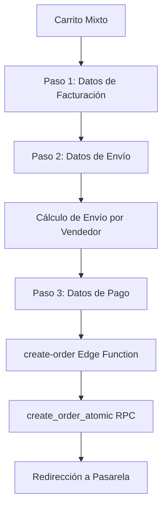
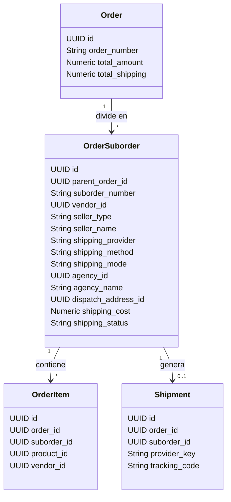

# AUDITORÍA DE ENVÍO Y CHECKOUT MULTI-VENDOR POR PAQUETES (COLLECTIBLES UY)

Este reporte detalla el estado actual del checkout multi-vendedor y la logística de envíos para la plataforma **Collectibles.uy**, analizando el frontend, las Edge Functions del backend, y la base de datos de Supabase.

---

## 1. FLUJO DE COMPRA Y LOGÍSTICA ACTUAL

El flujo actual en el Checkout consta de 3 pasos:



### 1.1 Frontend (Checkout.tsx)
1. **Agrupación de Productos por Vendedor (Store Key)**:
   - Se agrupan los items en el frontend mediante la función `getStoreKey(item)`:
     ```typescript
     const getStoreKey = (item: any): string => {
       const vId = item.vendor_id;
       const sId = item.vendor_store_id;
       if (!vId || vId === 'platform' || vId === 'null' || vId === 'undefined') {
         return 'collectibles';
       }
       if (sId && sId !== 'null' && sId !== 'undefined') {
         return sId;
       }
       return vId;
     };
     ```
   - Si no hay `vendor_id`, o es `'platform'`, se agrupa bajo `'collectibles'` (vendedor de la plataforma).
2. **Carga de Datos de Envío del Vendedor**:
   - `loadVendorsShippingInfo` carga de Supabase la configuración de envío (`shipping_settings` y `promotions_opt_in`) desde la tabla `vendors` para cada vendedor en el carrito.
   - También consulta la dirección de despacho (`vendor_dispatch_addresses`) para determinar la ciudad y departamento de origen de cada paquete.
   - **Grave Problema Detectado**: Si `vendor_id` es null o undefined, y el producto tiene una `vendor_store_id` (vendedor con múltiples tiendas pero sin `vendor_id` en el item), el frontend podría terminar consultando `vendors?id=eq.null` o `vendor_dispatch_addresses?vendor_id=eq.null`, lo cual genera errores 400 en Supabase.
3. **Selección del Método de Envío por Paquete**:
   - Para cada paquete (agrupado por `storeKey`), se listan sus métodos de envío habilitados.
   - El cliente selecciona el método y, en caso de elegir **Retiro en agencia DAC**, selecciona la oficina destino (`dac_offices` del departamento del cliente).
   - Las selecciones se guardan en el estado `subordersShipping: Record<string, { method: string, selectedAgency?: any }>`.
4. **Cálculo del Costo de Envío (`useEffect` de cálculo)**:
   - Se realiza un loop sobre cada grupo del carrito.
   - Si el método seleccionado es `dac_home` o `dac_agency`, se invoca la Edge Function `dac-get-cost` de manera independiente para cada paquete con el subtotal y productos del grupo.
   - Si el método es `soydelivery`, `ues`, `correo_uruguayo`, `manual` o `pickup`, el costo se determina localmente según la configuración del vendedor y el subtotal de ese grupo.
   - El costo consolidado se guarda en `shipping` sumando los costos de todos los grupos.
5. **Avance y Validación (Paso 2 -> 3)**:
   - Se valida que todos los grupos tengan un método seleccionado válido y que se hayan calculado los costos correctamente (`dacCalculationStatus === 'success'`).
6. **Creación de la Orden (`handlePlaceOrder`)**:
   - Llama a `createCheckoutOrder` pasando un payload consolidado.
   - Envía el mapeo de subórdenes en `suborders_shipping`.
   - **Grave Defecto de Negocio**: La dirección del master order se asume utilizando el método de envío del **primer paquete** en el carrito (`primaryMethod`). Si el primer paquete es `pickup` y el segundo es `dac_home`, el master order se marca como `pickup` a nivel global y con dirección de retiro, ignorando que el segundo requiere despacho a domicilio.

### 1.2 Backend (Edge Functions & DB)
1. **create-order Edge Function**:
   - Valida el payload de checkout con Zod.
   - Agrupa los items por vendedor (`groups` en base a `vendor_store_id` o `vendor_id`).
   - Resuelve la dirección de origen del vendedor y sus métodos permitidos.
   - Valida la disponibilidad del método para cada vendedor (defensa en el backend).
   - Si es DAC (`dac_home`/`dac_agency`), vuelve a invocar internamente `dac-get-cost` para verificar el costo cotizado.
   - Calcula el total acumulado de envíos.
   - Llama al RPC `create_order_atomic` en Supabase.
2. **create_order_atomic RPC**:
   - Recibe la lista consolidada de items (`p_items`) y la estructura de subórdenes (`p_suborders`).
   - Inserta la orden master en `orders`.
   - Itera por cada suborden en `p_suborders`:
     - Inserta en `order_suborders` los datos financieros (`product_subtotal`, `shipping_cost`, `marketplace_fee`, etc.).
     - Asocia los items filtrándolos por `vendor_id`:
       ```sql
       INSERT INTO public.order_items (...)
       SELECT ... FROM jsonb_array_elements(p_items) AS item
       WHERE (item->>'vendor_id' = v_vendor_id::text) 
          OR (v_vendor_id IS NULL AND item->>'vendor_id' IS NULL);
       ```
     - Descuenta el stock de las variantes en `product_variants`.

---

## 2. TABLAS Y CAMPOS LOGÍSTICOS ACTUALES

### 2.1 Tabla `orders` (Master)
- `id` (UUID, PK)
- `order_number` (TEXT, único, e.g. `COL-YYYYMMDD-0001`)
- `total_amount` (NUMERIC)
- `subtotal_products` (NUMERIC)
- `total_shipping` (NUMERIC)
- `total_discounts` (NUMERIC)
- `shipping_provider` (TEXT, e.g. `'DAC'`, `'SoyDelivery'`, `'pickup'`)
- `shipping_address` (JSONB, guarda la dirección física, modo DAC y agencia si aplica)
- `status` (TEXT, e.g. `'pending'`)
- `payment_status` (TEXT, e.g. `'pending_payment'`)

### 2.2 Tabla `order_suborders` (Subórdenes/Paquetes)
- `id` (UUID, PK)
- `parent_order_id` (UUID, FK a `orders`)
- `suborder_number` (TEXT, único, e.g. `COL-YYYYMMDD-0001-A`)
- `vendor_id` (UUID, FK a `vendors`, nullable)
- `vendor_name` (TEXT)
- `vendor_store_id` (UUID, FK a `vendor_stores`, nullable)
- `vendor_store_name` (TEXT)
- `is_collectibles_order` (BOOLEAN)
- `product_subtotal` (NUMERIC)
- `shipping_method` (TEXT, e.g. `'dac_home'`, `'dac_agency'`, `'pickup'`)
- `shipping_provider` (TEXT, e.g. `'dac'`, `'pickup'`, `'ues'`)
- `shipping_cost` (NUMERIC)
- `shipping_status` (TEXT)
- `tracking_number` (TEXT, nullable)
- `tracking_url` (TEXT, nullable)
- `status` (TEXT, e.g. `'pending'`)
- **Campos Financieros de Collectibles Envíos**:
  - `shipping_charged_to_customer` (NUMERIC)
  - `shipping_provider_cost` (NUMERIC)
  - `shipping_paid_by` (TEXT, `'collectibles'` o `'vendor'`)
  - `shipping_billing_mode` (TEXT, `'collectibles_envios'` o `'vendor_own_account'`)
  - `shipping_margin` (NUMERIC)
  - `shipping_provider_invoice_status` (TEXT)

### 2.3 Tabla `order_items`
- `id` (UUID, PK)
- `order_id` (UUID, FK a `orders`)
- `suborder_id` (UUID, FK a `order_suborders`)
- `product_id` (UUID, FK a `products`)
- `variant_id` (UUID, FK a `product_variants`, nullable)
- `vendor_id` (UUID, FK a `vendors`, nullable)
- `vendor_store_id` (UUID, FK a `vendor_stores`, nullable)
- `quantity` (INTEGER)
- `unit_price` (NUMERIC)
- `total_price` (NUMERIC)
- `product_name` (TEXT)
- `sku` (TEXT)
- `discount_total` (NUMERIC)
- `final_total` (NUMERIC)

### 2.4 Tabla `shipments` (Envíos físicos generados)
- `id` (UUID, PK)
- `order_id` (UUID, FK a `orders`)
- `suborder_id` (UUID, FK a `order_suborders`, nullable)
- `provider_key` (TEXT, FK a `shipping_providers.code`)
- `tracking_code` (TEXT, nullable)
- `internal_reference` (TEXT, e.g. `COL-SUBORDER-NUMBER`)
- `external_guide` (TEXT)
- `shipping_status` (TEXT, e.g. `'documented'`, `'failed'`)
- `shipping_label_url` (TEXT)

### 2.5 Tabla `shipping_providers`
- `code` (TEXT, PK, e.g. `'dac'`, `'soydelivery'`, `'ues'`, `'correo_uruguayo'`, `'pickup'`, `'manual'`)
- `name` (TEXT)
- `is_active` (BOOLEAN)
- `status` (TEXT)
- `provider_type` (TEXT)
- `settings` (JSONB)

### 2.6 Tabla `vendor_dispatch_addresses`
- `id` (UUID, PK)
- `vendor_id` (UUID, FK a `vendors`)
- `vendor_store_id` (UUID, FK a `vendor_stores`, nullable)
- `address`, `city`, `department`, `phone`
- `is_default` (BOOLEAN)

---

## 3. QUÉ ESTÁ FUNCIONANDO CORRECTAMENTE

1. **Agrupación y Desglose por Vendedor**: El frontend agrupa correctamente los productos del carrito por vendedor (`getStoreKey`).
2. **Cálculo de Envío Distribuido**: Se realiza el cálculo del envío llamando a la API de DAC de forma independiente para cada paquete, y se suman correctamente los envíos en el subtotal.
3. **BYOC (Bring Your Own Credentials)**: El backend (`shipping-worker` y `dac-create-shipment`) sabe diferenciar si el vendedor tiene sus propias credenciales de envío en `vendor_shipping_connections` o si debe usar la cuenta global de la plataforma (Collectibles Envíos).
4. **Persistencia Básica de Subórdenes**: El RPC `create_order_atomic` inserta registros en `order_suborders` e implementa la separación de `order_items` según su `vendor_id`.
5. **Gestión Financiera de Envíos**: Se calculan correctamente los costos, márgenes y modos de facturación de envío (`shipping_billing_mode`) en `order_suborders`.

---

## 4. QUÉ ESTÁ INCOMPLETO O INCOHERENTE

1. **Ausencia de Campos de Arquitectura en la Base de Datos (`order_suborders`)**:
   La base de datos carece de columnas fundamentales para persistir y validar la logística a nivel de paquete:
   - `seller_type` (e.g. `'platform'` o `'vendor'`) para clasificar quién despacha.
   - `shipping_mode` (e.g. `'home'` o `'agency'`) para saber si va a domicilio o retiro.
   - `pickup_type` (e.g. `'local'` o `'agency'`) para el tipo de retiro.
   - `agency_id` (UUID) y `agency_name` (TEXT) para persistir la sucursal seleccionada para retiro de ese paquete.
   - `dispatch_address_id` (UUID) para documentar cuál dirección de despacho del vendedor originó el envío.
   - `internal_reference` (TEXT) duplicado o explícito a nivel de suborden.
2. **Defecto en la Dirección Consolidada de la Orden**:
   El frontend asume la dirección y el método de envío del primer paquete en el carrito como el "método global" para la orden principal. Esto rompe la coherencia logística cuando hay métodos mixtos.
3. **Resumen de Orden Plano**:
   El Paso 3 de Pago y el resumen final no muestran un desglose detallado de los paquetes ("Tu pedido se divide en X paquetes..."). Muestra un total consolidado de envío que confunde al usuario.
4. **Falta de Integración de Tracking Individual**:
   El Portal del Cliente y el Dashboard del Vendedor muestran la información de tracking de forma general o no aprovechan al 100% las subórdenes separadas, lo que dificulta al cliente saber qué paquete está en camino.

---

## 5. BUGS CRÍTICOS Y RIESGOS DE CARRITOS MIXTOS

### 5.1 Error de Compilación en Calamidad: `RefreshCcw` undefined
- En el Paso 2 (Datos de Envío) de `Checkout.tsx`, se utiliza la etiqueta `<RefreshCcw className="w-3.5 h-3.5" />` en la línea 2975 para permitir que el usuario reintente el cálculo de envío si falla DAC.
- **Sin embargo, `RefreshCcw` no se importó de `lucide-react` en la línea 3**. Si el cálculo falla, el checkout colapsará completamente con un error de referencia de JavaScript, bloqueando la pantalla del usuario.

### 5.2 Mismatch de UUID en Zod de `create-order`
- El Zod Schema de `create-order` define `vendor_id` como un UUID.
- Si en el frontend un producto de la plataforma tiene `vendor_id` con el valor string `"platform"`, `"null"`, o `"undefined"`, y no se filtra adecuadamente, el backend rechazará la petición con un error de validación Zod (`invalid_string` de tipo UUID), impidiendo la finalización de la compra.

### 5.3 Consultas Vacías a Supabase
- Si un vendedor de la plataforma tiene `vendor_id = null`, el código del frontend puede terminar consultando:
  `vendors?id=eq.null`
  `vendor_dispatch_addresses?vendor_id=eq.null`
  Esto ocurre si la lógica no descarta proactivamente el valor `null` antes de ejecutar la petición `.eq('id', vendorId)`.

---

## 6. CAMBIOS Y ARQUITECTURA PROPUESTA



### 6.1 Fase 2: Ajuste de Base de Datos (Migración)
Se debe crear una migración que agregue a `order_suborders` los siguientes campos:
```sql
ALTER TABLE public.order_suborders
  ADD COLUMN IF NOT EXISTS seller_type TEXT CHECK (seller_type IN ('platform', 'vendor')),
  ADD COLUMN IF NOT EXISTS shipping_mode TEXT CHECK (shipping_mode IN ('home', 'agency', 'pickup')),
  ADD COLUMN IF NOT EXISTS pickup_type TEXT,
  ADD COLUMN IF NOT EXISTS agency_id UUID,
  ADD COLUMN IF NOT EXISTS agency_name TEXT,
  ADD COLUMN IF NOT EXISTS dispatch_address_id UUID,
  ADD COLUMN IF NOT EXISTS internal_reference TEXT;
```

### 6.2 Fase 3: Frontend - Rediseño del Paso 2
- Mostrar de forma clara: *"Tu pedido contiene productos de distintos vendedores y se dividirá en X paquetes"*.
- Para cada paquete, renderizar las opciones de envío disponibles y el cálculo de costo en tiempo real correspondiente.
- Si requiere agencia DAC, mostrar el selector de agencias de ese paquete específico.

### 6.3 Fase 4: Frontend - Resumen del Carrito
- En el lateral del checkout, desglosar el envío por paquete/vendedor en lugar de un único valor plano.

### 6.4 Fase 5: Validación del Checkout
- Modificar `validateStep2()` para devolver una estructura de errores granular:
  ```json
  {
    "valid": false,
    "errors": [
      {
        "group_id": "vendor-uuid",
        "seller_name": "JorgiToys",
        "field": "agency",
        "message": "Seleccioná una agencia DAC para JorgiToys."
      }
    ]
  }
  ```

### 6.5 Fase 6: Edge Function & RPC (`create-order`)
- Modificar `create-order` para recibir el desglose completo de métodos de envío por suborden.
- Validar y calcular cada suborden de manera independiente.
- Insertar los nuevos campos en `create_order_atomic`.

---

## 7. MATRIZ DE RIESGOS Y MITIGACIÓN

| Riesgo | Impacto | Probabilidad | Mitigación |
| :--- | :--- | :--- | :--- |
| **Error en Pago Handy** | Crítico | Media | Mantener y validar la conversión a `invoiceNumber` de 32 bits y garantizar que no se inserte un ID inválido. |
| **Falta de Stock Concurrente** | Alto | Baja | El RPC `create_order_atomic` realiza un bloqueo `FOR UPDATE` sobre las variantes para garantizar consistencia transaccional. |
| **Pérdida de items de la Plataforma** | Crítico | Baja | Validar en el RPC que los items con `vendor_id IS NULL` queden asociados a la suborden principal de la plataforma. |
| **Llamadas a la API de DAC bloqueadas** | Alto | Media | Controlar tiempos de carga en el frontend e implementar `AbortController` al cambiar rápidamente de opciones de envío. |
