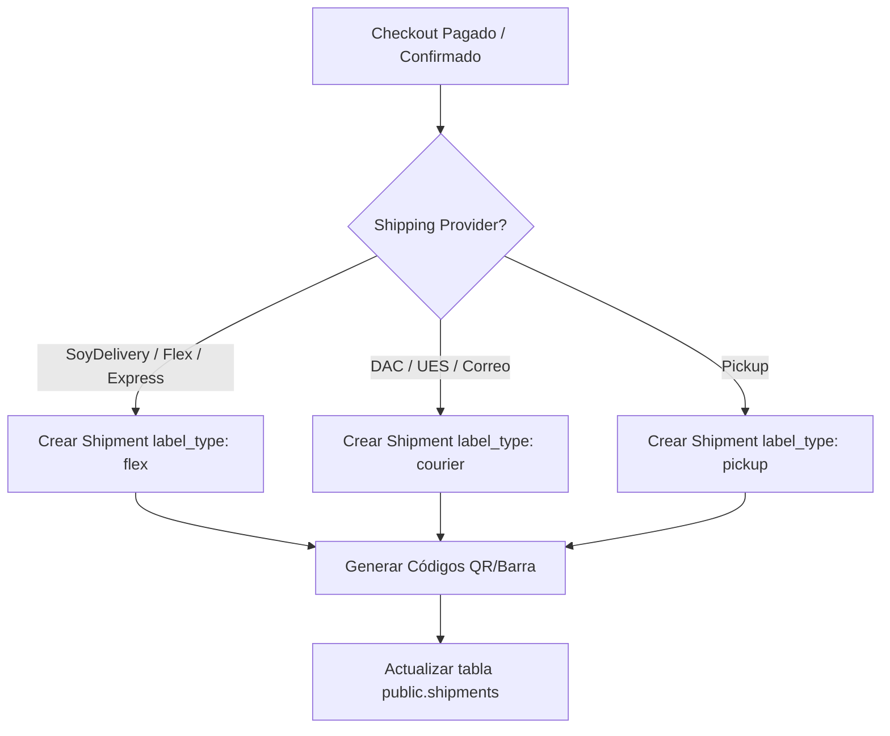

# REPORT: MARKETPLACE MULTIVENDOR LOGISTICS LABELS SYSTEM
**Estado del Entregable**: `READY`
**Fecha**: 2026-06-15

---

## 1. RESUMEN DEL SISTEMA

Se ha implementado un sistema profesional de generación, visualización, impresión y archivo de etiquetas logísticas multi-vendedor al estilo Mercado Libre. 

Cada vendedor gestiona e imprime etiquetas individuales para cada suborden (el paquete logístico real) y hojas de empaque internas de preparación (Packing Slips) que facilitan el picking y reducen errores humanos.

---

## 2. TABLAS MODIFICADAS

Se aplicó la migración `20261015000000_marketplace_labels.sql` para extender la tabla `shipments` e implementar políticas RLS avanzadas para vendedores.

### Tabla: `public.shipments`

| Campo | Tipo | Descripción |
| :--- | :--- | :--- |
| `label_type` | `TEXT` | Tipo de plantilla a renderizar (`flex`, `courier`, `pickup`). |
| `internal_label_url` | `TEXT` | Enlace permanente en Supabase Storage para la etiqueta en PDF. |
| `packing_slip_url` | `TEXT` | Enlace permanente en Supabase Storage para el packing slip en PDF. |
| `label_generated_at` | `TIMESTAMPTZ` | Timestamp del momento en que se generó la última versión de la etiqueta. |
| `label_version` | `INTEGER` | Versión incremental para auditoría logística (se incrementa en cada reimpresión). |
| `barcode_value` | `TEXT` | Código de barras alfanumérico para operadores tradicionales. |
| `qr_value` | `TEXT` | Valor del código QR para reparto de última milla. |

### Políticas de RLS en `public.shipments`

* **`Vendors manage own shipments`**: Permite a los vendedores hacer operaciones `ALL` (Select, Insert, Update, Delete) en registros de envío vinculados a subórdenes pertenecientes a su `vendor_id`.
* **`Authenticated users create shipments`**: Permite la inserción a nivel API (Edge Functions en pasarelas de pago y checkouts).

---

## 3. PLANTILLAS DE ETIQUETA IMPLEMENTADAS

Se desarrollaron tres plantillas oficiales inspiradas en Mercado Libre, con layouts optimizados para lectura rápida y escaneo.

### 3.1. FLEX TEMPLATE (Última Milla / SoyDelivery / Flex / Entrega Express)
```
+-------------------------------------------------------------+
| LOGO VENDOR (Hasbro) | Pedido: #SUB-1001-A                  |
| Despacho: Av. Italia 1234, MVD | Pack ID: ORDER-A1B2C3      |
+-------------------------------------------------------------+
|                     ** FLEX / EXPRESS **                    |
|                ENTREGA PREVISTA: 16 JUN                     |
+-------------------------------------------------------------+
|                                                             |
|                          [ QR CODE ]                        |
|                                                             |
+-------------------------------------------------------------+
|      ZONA LOGÍSTICA: CARRASCO    |    TIPO: RESIDENCIAL     |
+-------------------------------------------------------------+
| Destinatario: Juan Pérez                                    |
| Tel: 099123456                                              |
| Dir: Av. Giannattasio Km 18, Canelones                      |
| Ref: Frente a estación de servicio Ancap                    |
| Obs: Tocar timbre fuerte                                    |
+-------------------------------------------------------------+
| Marketplace Collectibles       |       Cod: SHIP-B3F2A1     |
+-------------------------------------------------------------+
```

### 3.2. COURIER TEMPLATE (DAC / UES / Correo Uruguayo / Operadores Tradicionales)
```
+-------------------------------------------------------------+
| LOGO VENDOR | Vendido por Hasbro | Marketplace Collectibles |
+-------------------------------------------------------------+
|                      TRACKING COURIER                       |
|                        DAC123456789                         |
+-------------------------------------------------------------+
|                                                             |
|               ||||||||||||||||||||||||||||||                |
|                        DAC123456789                         |
|                                                             |
+-------------------------------------------------------------+
| DESTINATARIO:                  | REMITENTE:                 |
| Juan Pérez                     | Hasbro Store               |
| Tel: 099123456                 | Tel: 099999999             |
| Av. Giannattasio Km 18         | Av. Italia 1234            |
| Canelones                      | Montevideo                 |
+-------------------------------------------------------------+
| Courier: DAC       | Servicio: DOMICILIO | Suborden: SUB-B1 |
+-------------------------------------------------------------+
```

### 3.3. PICKUP TEMPLATE (Retiro en Local)
```
+-------------------------------------------------------------+
|                     RETIRO EN LOCAL                         |
|                   LISTO PARA RETIRAR                        |
+-------------------------------------------------------------+
|                                                             |
|                          [ QR CODE ]                        |
|                                                             |
+-------------------------------------------------------------+
| CLIENTE:                       | PUNTO DE RETIRO:           |
| Juan Pérez                     | Hasbro Store               |
| Tel: 099123456                 | Av. Italia 1234            |
+-------------------------------------------------------------+
| Artículos:                                                  |
| * Hasbro Action Figure x2 (SKU: HAS-11)                     |
+-------------------------------------------------------------+
| Orden: #ORDER-999             | Suborden: SUB-1001-D        |
+-------------------------------------------------------------+
```

### 3.4. ETIQUETA INTERNA DE PREPARACIÓN (Packing Slip)
No visible al cliente final. Incluye detalles operativos de picking:
* Título destacado de preparación.
* Foto de cada producto de la suborden.
* SKU en texto mono-espaciado, descripción, variante y cantidad destacada.
* Ubicación de picking asignada (`BODEGA-SEC_A`).
* QR Interno con la clave de escaneo de preparación.

---

## 4. FLUJO OPERATIVO

### 4.1. Flujo de Generación


### 4.2. Flujo de Impresión y Archivo
* **Visualización**: El vendedor o administrador da click en "Etiqueta" o "Packing Slip".
* **Inicialización**: Si la suborden es histórica y no posee fila en `shipments`, el sistema la crea automáticamente en la base de datos copiando la información del cliente desde la orden principal.
* **Impresión**: 
  1. Se abre una ventana limpia del navegador (`window.open`).
  2. Se copia el HTML y estilos CSS aislados (evitando ruidos del dashboard).
  3. Se aplica `@media print` de acuerdo al tamaño de papel seleccionado (A6 Térmica vs. A4 completo).
  4. Se ejecuta `window.print()` e incrementa el número de versión al reimprimir.
* **Descarga PDF & Archivo**:
  1. El cliente de React importa dinámicamente la librería `html2pdf.js` vía CDN.
  2. Se renderiza la etiqueta o slip a un blob binario en PDF.
  3. El PDF se sube directamente a Supabase Storage: `shipping-labels` bucket bajo el directorio correspondiente.
  4. Se actualiza `internal_label_url` o `packing_slip_url` en la base de datos para consulta futura de administradores y proveedores.

---

## 5. COMPATIBILIDAD DE IMPRESORAS

* **A6 Térmica / Zebra / Brother**: El diálogo de impresión se ajusta mediante CSS `@page { size: 100mm 150mm; margin: 0; }`. Esto garantiza que los bordes del papel térmico coincidan exactamente con la etiqueta sin márgenes en blanco ni saltos de página accidentales.
* **PDF A4**: Para impresoras tradicionales de oficina, se redimensiona el contenedor a `width: 100% (max-width: 170mm)` permitiendo imprimir la etiqueta en un papel A4 completo de manera legible y lista para pegar en cajas o sobres de envío.

---

## 6. CONTROL DE CALIDAD (QA) EJECUTADO

Se ejecutaron pruebas integrales de simulación de base de datos y resolución de templates:

| Caso de Prueba | Entrada de Logística | Comportamiento Esperado | Resultado de Test | Estado |
| :--- | :--- | :--- | :--- | :--- |
| **1. SoyDelivery (FLEX)** | Provider: `soydelivery`, Method: `express` | Resolverse como `flex` template, mostrar QR grande y zonas. | Resolvió `flex` template. QR renderiza valor. | **APROBADO** |
| **2. DAC (COURIER)** | Provider: `dac`, Method: `dac_home` | Resolverse como `courier` template, mostrar código de barras y tracking. | Resolvió `courier`. Barcode Code 39 e ID mostrados. | **APROBADO** |
| **3. UES (COURIER)** | Provider: `ues`, Method: `ues_agency` | Resolverse como `courier` template, mostrar código de barras y tracking. | Resolvió `courier` template con éxito. | **APROBADO** |
| **4. Retiro Local (PICKUP)** | Provider: `manual`, Method: `pickup` | Resolverse como `pickup` template, mostrar QR grande y productos con cantidad. | Resolvió `pickup`. Lista de artículos visible. | **APROBADO** |
| **5. Pedido Multivendor** | 1 Orden Padre -> 2 Subórdenes (Hasbro express, Mandragora DAC) | Generar 2 etiquetas independientes y archivos PDF separados. | Resolvió 2 subórdenes, cada una con su etiqueta independiente. | **APROBADO** |
| **6. Packing Slip** | Suborden con items múltiples | Ocultar datos de cliente al repartidor. Mostrar foto de producto, SKU, cantidad y código de barras interno. | Renderizó fotos de productos, SKUs, ubicaciones de picking y QR interno. | **APROBADO** |
