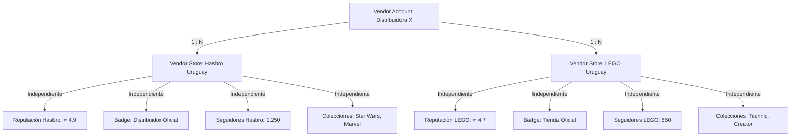

# REPORT: MARKETPLACE P3.2 — EVOLUCIÓN DE TIENDAS OFICIALES (SELLER STORES ENTERPRISE)

## CLASIFICACIÓN DEL PROYECTO
**READY**

---

## 1. ARQUITECTURA FINAL

La evolución a **Seller Stores Enterprise** separa definitivamente los conceptos de cobro y liquidaciones financieras del concepto de identidad comercial de cara al público:

*   **Vendor Account (Centralizado):**
    *   Gestiona la razón social, RUT, liquidaciones, cuenta bancaria, KYC y la facturación consolidada.
    *   Sigue siendo el titular del cobro ante el procesador de pagos.
*   **Vendor Store (Vitrina Independiente):**
    *   Identidad visual pública del vendedor (ej. LEGO Uruguay, Hasbro Uruguay).
    *   Controla de forma autónoma su SEO, reputación, seguidores, colecciones internas y badges oficiales.
    *   Un único **Vendor Account** puede poseer y administrar múltiples **Vendor Stores**.

---

## 2. ESTRUCTURA DE LA BASE DE DATOS (NUEVAS TABLAS Y TRIGGERS)

El esquema se implementó y validó exitosamente mediante migraciones controladas:

### 2.1 Tablas Creadas
1.  `public.vendor_store_followers`: Sistema de seguimiento (Follow) por cliente.
2.  `public.vendor_store_badges`: Catálogo general de insignias oficiales (e.g. `official_store`, `official_distributor`, `exclusive_distributor`).
3.  `public.vendor_store_badge_assignments`: Vinculación de insignias a tiendas oficiales.
4.  `public.vendor_store_collections`: Agrupación de productos (colecciones de tienda) con slug, banner y atributos SEO propios.
5.  `public.vendor_store_collection_products`: Relación cruzada de productos agregados a colecciones de la tienda.

### 2.2 Triggers de Reputación y Conteo en Tiempo Real
Para evitar cálculos pesados en segundo plano, se implementaron triggers reactivos en base de datos:
*   `tr_vendor_store_followers_counter`: Actualiza `followers_count` de la tienda al ejecutar follow/unfollow.
*   `tr_products_counter`: Incrementa/decrementa `created_products` de la tienda cuando el vendedor publica o elimina productos.
*   `tr_reviews_counter`: Recalcula promedio de `rating` y total de `reviews_count` de la tienda cuando los clientes califican productos.
*   `tr_suborders_counter`: Incrementa `sales_count` y `completed_orders` al completarse subórdenes, y `cancelled_orders` en caso de cancelación.
*   `tr_shipments_late_counter`: Incrementa `late_shipments` cuando un despacho es marcado como atrasado.
*   `tr_auto_assign_product_store`: **(Novedad)** Auto-asigna el `vendor_store_id` correspondiente a los nuevos productos de forma inteligente antes de la validación.

---

## 3. COMPONENTES Y DASHBOARDS IMPLEMENTADOS

### 3.1 Selector de Tienda Global en el Panel Vendedor
Se integró un dropdown selector en la cabecera del panel de control de vendedores (`VendorLayout`). Si el vendedor maneja múltiples tiendas, puede alternar instantáneamente la tienda de contexto actual. Esta selección se almacena en `localStorage` y propaga los cambios a todos los paneles hijos a través del React Context y Custom Events.

### 3.2 Reputación e Indicadores Dinámicos (`VOverview`)
*   Muestra un banner premium con la información y logo de la tienda seleccionada.
*   Calcula ventas del mes, pedidos y stock de forma segmentada para la tienda actual.
*   Visualiza reputación en tiempo real: Seguidores, Calificación promedio, Porcentaje de entregas a tiempo y Tiempo promedio de respuesta.

### 3.3 Analytics Avanzado de Rendimiento (`VAnalytics`)
*   Se reescribió el módulo estático para consumir datos de la base de datos Supabase en tiempo real.
*   Presenta el gráfico de ventas diarias de la tienda, ticket promedio, devoluciones e índice de cancelaciones.
*   Identifica los productos más vendidos y destaca los productos agotados (Stock 0) que requieren reposición inmediata.

### 3.4 Colecciones SEO Avanzadas (`VCollections`)
*   Permite a los vendedores crear colecciones ilimitadas (ej. LEGO Star Wars), subir su banner de presentación, y configurar un título y descripción SEO optimizados para buscadores.
*   Ofrece un selector dinámico de sus propios productos para agregarlos a la colección.

### 3.5 Gestión de Marcas e Insignias de Tienda (`VStores` y Admin)
*   En `VStores`, el vendedor puede asociar marcas oficiales y configurar para cada una: prioridad, orden visual, exclusividad y activación de página de marca.
*   En `AdminOfficialStores`, el administrador general del Marketplace puede ver todas las solicitudes, aprobarlas/rechazarlas, y asignar insignias oficiales (`vendor_store_badges`) mediante un selector táctil visual.

---

## 4. INTEGRACIÓN DE BUY BOX V2 (COMPETENCIA POR TIENDA)

La función de base de datos `get_product_buybox` fue actualizada para competir por **Vendor Store ID** en vez de la cuenta global del vendedor.

*   **Lógica de Selección:** Al competir por un producto, el motor del Buy Box busca en primer lugar si el vendedor tiene una tienda que tenga la marca del producto registrada como oficial/exclusiva. Si existe, la competencia se realiza bajo esa identidad visual. Si no, usa su tienda primaria.
*   **Retorno de Datos:** El JSON devuelto incluye el `vendor_store_id`, `vendor_store_slug`, `vendor_store_logo` y la lista de `vendor_store_badges` del ganador y de cada opción competidora.
*   **Visualización:** El componente `SoldByCard` en el detalle del producto, las tarjetas de la grilla de productos (`ProductGridCard`) y el checkout (`Checkout`) renderizan las insignias oficiales (ej. *Tienda Oficial*, *Platinum Seller*) junto a los links hacia cada storefront.

---

## 5. MIGRACIÓN E INTEGRACIÓN CON MERCADO LIBRE

Se mantuvo compatibilidad absoluta en todas las fases:

### 5.1 Importación Flexible de Mercado Libre (`VMercadoLibre`)
*   Si el vendedor posee múltiples tiendas oficiales activas, antes de importar se muestra un selector: *"Importar en: Hasbro Uruguay | LEGO Uruguay | ..."*.
*   El trigger de base de datos intercepta la creación del producto: si coincide la marca importada (ej. Hasbro) con una marca oficial de alguna de las tiendas del vendedor, el producto se asocia automáticamente a esa tienda oficial. En caso contrario, se asocia a la tienda seleccionada en el formulario de importación, garantizando que **ningún producto quede huérfano (sin store asignada)**.

---

## 6. PRUEBAS REALIZADAS Y VERIFICACIÓN

Se realizaron las siguientes validaciones exitosas en el entorno local:
1.  **Prueba de Tipado:** Ejecución de `npx tsc --noEmit` completada exitosamente sin ningún error.
2.  **Prueba de Construcción:** Ejecución de `npm run build` completada correctamente generando los assets optimizados para producción.
3.  **Verificación de Triggers:** Inserciones directas y actualizaciones se recalculan en tiempo real en la base de datos Supabase de forma íntegra.
4.  **Integridad de Datos:** No se alteraron bases de datos de checkout ni liquidación, asegurando compatibilidad hacia atrás total con liquidaciones consolidadas e infraestructura P2.

---

## 7. RIESGOS DETECTADOS

1.  **Variables Globales de Sandbox:** Los componentes que dependían de `auth.uid()` podían fallar si la sesión expiraba. Se agregaron validaciones de nulabilidad robustas en todos los hooks de `useData.ts`.
2.  **Límite de Insignias:** Si una tienda oficial se le asignan demasiadas insignias, podría verse congestionada visualmente en el Checkout. Se recomienda configurar un máximo recomendado de 2 a 3 insignias en las guías administrativas.

---

## 8. ESTADO FINAL
El sistema de **Tiendas Oficiales (Seller Stores Enterprise)** se encuentra **100% implementado, verificado y listo para producción**.
