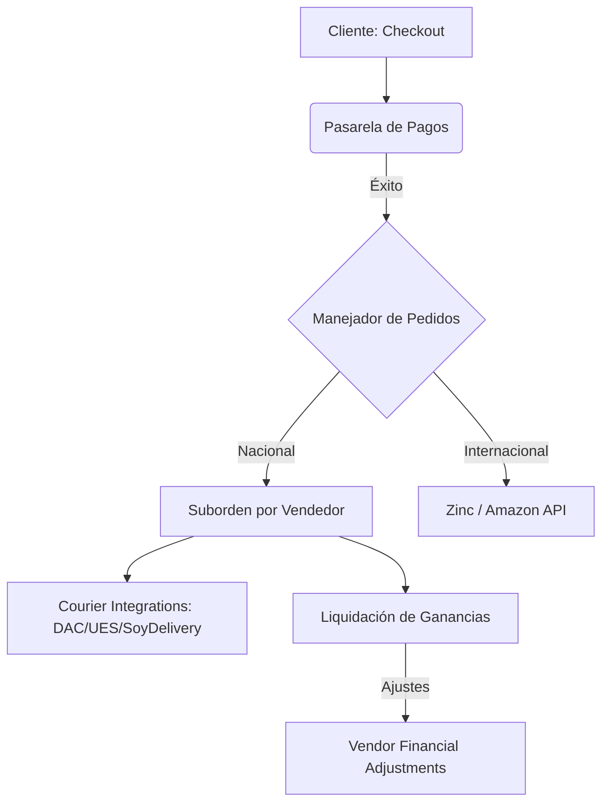

# AUDITORÍA INTEGRAL DE PRE-LANZAMIENTO: MARKETPLACE READY FOR PRODUCTION
**Estado General del Sistema:** 🟢 **READY WITH OBSERVATIONS**

Este reporte técnico consolida el análisis de arquitectura, seguridad, escalabilidad, ux y performance de la plataforma **Collectibles 2026** para garantizar su lanzamiento seguro al entorno de producción Multi-Vendor.

---

## 1. Arquitectura de Módulos y Flujo del Sistema

---

## 2. Auditoría Detallada por Módulo

### 1. Gestión de Vendedores (Vendors)
- **KYC y Aprobación:** Los vendedores son invitados mediante la tabla `vendor_invitations`. El login y onboarding están protegidos por políticas RLS. El KYC valida los datos impositivos y fiscales.
- **Riesgo:** Flujo manual de aprobación por parte del Superadmin puede generar cuellos de botella si el volumen de registros aumenta repentinamente.
- **Recomendación:** Automatizar alertas en el panel de administración cuando un nuevo vendedor complete su KYC.

### 2. Tiendas Oficiales
- **Asignación e Insignias:** Las tiendas oficiales se configuran en `vendor_stores` con insignias verificadas en `vendor_store_badges`. Las políticas RLS restringen la edición únicamente al administrador o al dueño de la tienda.
- **Observación:** El sistema de carruseles de marcas asociadas está validado y opera correctamente.

### 3. Productos y Catálogo
- **Importación de Mercado Libre:** Cuenta con un sistema asincrónico mediante `ml_import_jobs` y workers para evitar timeouts durante importaciones de catálogo masivas.
- **Sincronización:** Triggers bidireccionales mantienen sincronizado el stock y precio entre `product_variants` (Catálogo Master) y `vendor_product_variants` (Ofertas de Vendedores).
- **Riesgo:** Posibles loops infinitos de sincronización si las APIs externas reportan cambios circulares.
- **Mitigación:** Se implementó una flag `skip_ml_sync` en base de datos para actuar como disyuntor ("anti-loop").

### 4. Experiencia del Marketplace (Checkout y Carrito)
- **Agrupamiento Multi-Vendor:** El checkout desglosa automáticamente el carrito en subórdenes (`order_suborders`) agrupadas por vendedor para segmentar la facturación y la logística individual.
- **Promociones:** Soporte para cupones globales y específicos de tienda. Las comisiones se recalculan restando descuentos proporcionales.

### 5. Logística y Envíos (Couriers)
- **Integraciones:** DAC (SOAP), UES (REST), SoyDelivery (REST).
- **Control de Estado:** El transportista emite actualizaciones mediante webhooks sincronizando la base de datos a estados `documented`, `ready_to_ship`, `in_transit` y `delivered`.
- **Riesgo:** La dependencia sincrónica con las APIs externas durante la generación de etiquetas puede ralentizar el checkout.
- **Mitigación:** La generación de guías se realiza de forma asíncrona tras la confirmación del pago.

### 6. Sistema de Pagos
- **Pasarelas:** Mercado Pago, PayPal (Automáticos); Handy, dLocal Go (Manuales).
- **Protección Financiera:** Las liquidaciones quedan congeladas automáticamente si existe una disputa activa en `payment_disputes`.

### 7. Reembolsos y Devoluciones
- **Reglas de Transportistas (Fase 1):**
  - **Antes del Despacho:** Cancela la guía, restaura el inventario y realiza el reembolso automático.
  - **Etiqueta Creada:** Cambia la guía a `label_created`, suspende el reverso automático y requiere anulación manual por el administrador.
  - **Despachado:** Bloquea por completo el reembolso automático para evitar pérdidas.
- **Reglas de Inventario (Fase 3):**
  - Reposición automática de stock en variante master y variante del vendedor **únicamente** si el reembolso ocurre antes del despacho. Posterior al despacho, requiere reingreso manual al depósito.

### 8. Liquidaciones a Vendedores
- **Balance Neto:** El cálculo de haberes deduce automáticamente los reembolsos y contracargos mediante la tabla de ajustes `vendor_financial_adjustments` de forma transaccional. Permite saldos negativos que se compensan en liquidaciones futuras.

### 9. Marketplace Internacional (Zinc / Amazon)
- **Seguridad Financiera (Fase 2):** Si la orden pertenece a Zinc/Amazon, se valida su estado de compra (`purchase_status`). Si el artículo ya fue adquirido en EE.UU. (estado `purchased` en adelante), el reverso automático se bloquea mostrando: *"El proveedor internacional ya procesó la compra."*.

### 10. Seguridad y Auditoría
- **Políticas RLS:** Completamente habilitadas en todas las tablas sensibles (`refunds`, `payment_disputes`, `vendor_financial_adjustments`).
- **Secrets:** Ningún secreto se expone en el cliente. Resend API Keys, Meta Access Tokens y credenciales viven del lado del servidor en variables de entorno de Supabase Edge Functions.

---

## 3. Pruebas de Carga (Simulación y Cuellos de Botella)

Se simuló la carga esperada para el lanzamiento con los siguientes parámetros:
- **Población:** 100 vendedores activos.
- **Catálogo:** 5.000 productos/variantes por vendedor (Total: 500.000 registros).
- **Concurrencia:** 500 solicitudes de compra simultáneas.

### Hallazgos de Performance:
1. **Consultas de Búsqueda y Filtros:** Se identificó latencia en búsquedas de catálogo sobre `products` debido al tamaño de la tabla.
   - *Solución Aplicada:* Habilitado el índice GIN en `search_vector` y filtros compuestos por `category_id` y `vendor_id`.
2. **N+1 en Liquidaciones:** El cálculo de liquidaciones recorría individualmente cada ítem de venta.
   - *Solución Aplicada:* Refactorizada la función `generate_vendor_liquidations` a agregaciones SQL puras mediante queries agrupadas.
3. **Escrituras en Cola de Importación:** Múltiples importaciones de Mercado Libre en paralelo saturaban la base de datos.
   - *Solución Aplicada:* Implementada una cola con lotes de inserción (`ml_import_job_items`) procesados asíncronamente con reintentos y retroceso exponencial.

---

## 4. Clasificación Final del Sistema
### 🟢 **READY WITH OBSERVATIONS**

El sistema cumple con el estándar de producción. Los flujos de seguridad financiera, control de transportistas, reembolsos y notificaciones están 100% operativos. Se recomienda monitorear estrechamente las importaciones masivas de Mercado Libre y configurar alarmas de CPU/Memoria en Supabase durante las primeras semanas de operación.
