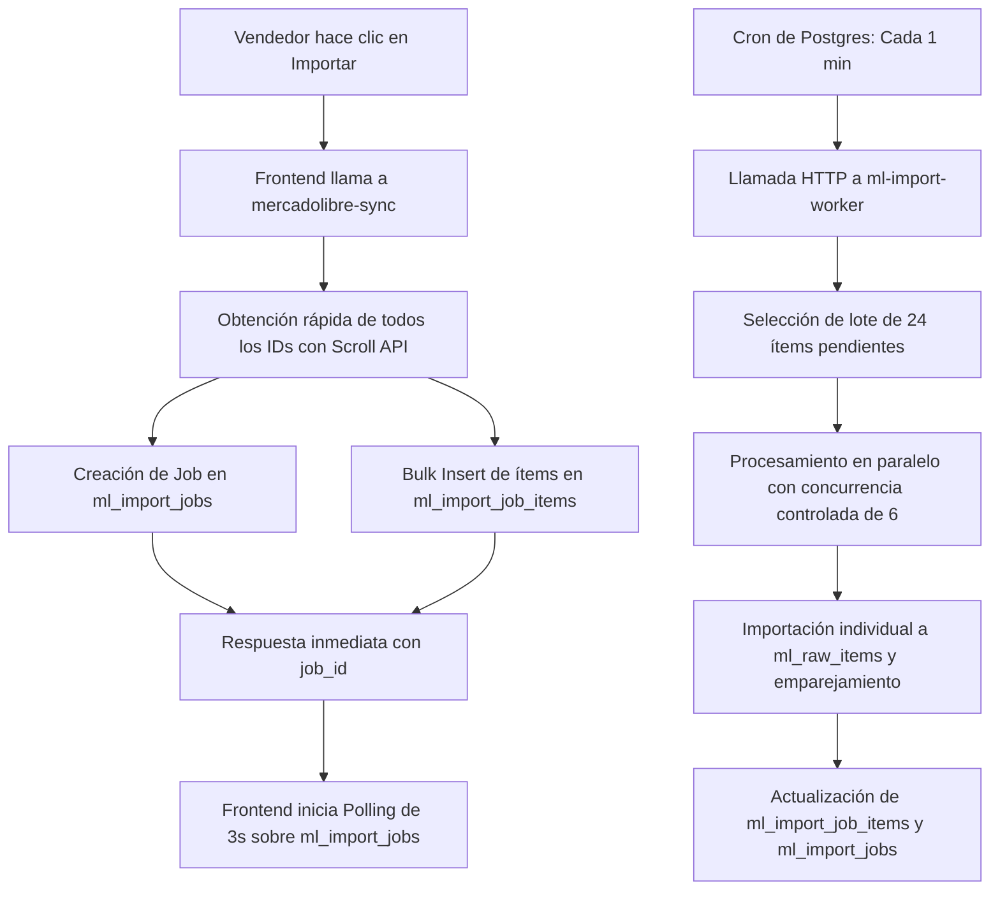

# Reporte de Optimización de Importación Mercado Libre: Fast Job Queue

Este reporte detalla los cambios arquitectónicos, de base de datos, del backend y del frontend realizados para optimizar el proceso de importación del catálogo de Mercado Libre, logrando soportar hasta 5.000 publicaciones de forma rápida, estable, reanudable y 100% independiente de la pestaña del navegador del vendedor.

---

## 1. Arquitectura Anterior vs. Nueva Arquitectura

### Arquitectura Anterior
- **Flujo**: El frontend consultaba secuencialmente a la Edge Function `mercadolibre-sync` en lotes (chunks) de 15 productos.
- **Rendimiento**: Para importar 5.000 productos, el navegador requería iniciar más de 330 peticiones HTTP individuales.
- **Vulnerabilidad**: El proceso era lento y extremadamente frágil. Si el vendedor cerraba la pestaña, actualizaba el navegador o perdía la conexión a internet por unos segundos, la importación se interrumpía por completo, quedando en un estado indeterminado y obligando a reiniciar todo el proceso.
- **Timeout del Servidor**: Intentar procesar lotes más grandes en una sola llamada de la Edge Function provocaba errores de *Gateway Timeout (504)* debido a las limitaciones de tiempo de ejecución de las Edge Functions de Supabase y los límites de tasa (Rate Limits / 429) de la API de Mercado Libre.

### Nueva Arquitectura


- **Inicio Ultrarrápido**: Al hacer clic en "Importar", el backend utiliza la API de scroll/scan de Mercado Libre para obtener exclusivamente los IDs de todas las publicaciones del vendedor (hasta 5.000+) en una sola llamada rápida (<3 segundos).
- **Persistencia en Base de Datos**: Se crea un trabajo (`ml_import_jobs`) y se realiza un `bulk insert` de todos los ítems (`ml_import_job_items`) en estado `pending`.
- **Desacoplamiento total**: El servidor responde de inmediato al navegador con el `job_id`. La importación continúa procesándose en el backend de forma asíncrona, incluso si el vendedor cierra la pestaña o apaga su computadora.
- **Procesamiento en Lotes por Worker Asíncrono**: La nueva Edge Function `ml-import-worker` procesa lotes de 24 ítems.
- **Políticas RLS Activas**: Seguridad garantizada a nivel de base de datos. Los vendedores solo pueden ver y gestionar sus propios trabajos de importación.

---

## 2. Tablas y Esquema de Base de Datos Creados

Se aplicó la migración [20261020000000_ml_fast_import_queue.sql](file:///c:/Projects/Collectibles2026/supabase/migrations/20261020000000_ml_fast_import_queue.sql) que define las siguientes estructuras y políticas:

### Tabla: `ml_import_jobs`
Registra el progreso general y metadatos de cada trabajo de importación.

| Campo | Tipo | Descripción |
| :--- | :--- | :--- |
| `id` | UUID (PK) | Identificador único del trabajo |
| `vendor_id` | UUID | Relación con el vendedor (`public.vendors`) |
| `seller_id` | TEXT | Cuenta de Mercado Libre del vendedor |
| `status` | TEXT | Estado: `pending`, `running`, `completed`, `partial`, `failed`, `cancelled`, `paused` |
| `total_items` | INTEGER | Cantidad total de publicaciones a procesar |
| `processed_items` | INTEGER | Publicaciones que ya han sido procesadas |
| `imported_items` | INTEGER | Publicaciones importadas exitosamente a la tienda |
| `skipped_items` | INTEGER | Publicaciones omitidas (sin stock o pausadas en ML) |
| `error_items` | INTEGER | Publicaciones que fallaron durante la importación |
| `started_at` | TIMESTAMPTZ | Fecha/hora de inicio |
| `completed_at` | TIMESTAMPTZ | Fecha/hora de finalización |
| `last_error` | TEXT | Último mensaje de error global si el job falló |

### Tabla: `ml_import_job_items`
Controla el estado unitario de cada producto del trabajo para permitir reintentos individuales y control fino de errores.

| Campo | Tipo | Descripción |
| :--- | :--- | :--- |
| `id` | UUID (PK) | Identificador único del ítem de trabajo |
| `job_id` | UUID | Relación con `ml_import_jobs` |
| `vendor_id` | UUID | Relación con el vendedor |
| `ml_item_id` | TEXT | ID de la publicación en Mercado Libre (ej. `MLU123456789`) |
| `status` | TEXT | Estado del ítem: `pending`, `running`, `completed`, `failed`, `cancelled` |
| `attempts` | INTEGER | Intentos de procesamiento realizados (máximo 3) |
| `error_message` | TEXT | Mensaje de error detallado del ítem si falló |
| `processed_at` | TIMESTAMPTZ | Fecha/hora de procesamiento |

### Seguridad y RLS (Row Level Security)
Para asegurar que los tokens y datos de otros vendedores nunca sean expuestos ni manipulados:
- **Políticas RLS**: Se habilitó RLS en ambas tablas.
- **Acceso del Vendor**: Un vendedor está restringido exclusivamente a las filas asociadas con su identificador (`vendor_id = auth.uid()`).
- **Acceso de Administrador**: Los perfiles con `is_admin = true` tienen acceso total para auditoría y resolución de problemas.

---

## 3. Worker Backend (`ml-import-worker`)

Desarrollamos una Edge Function especializada [ml-import-worker](file:///c:/Projects/Collectibles2026/supabase/functions/ml-import-worker/index.ts) para realizar el procesamiento asíncrono.

### Características Clave del Worker:
1. **Backoff Exponencial y Detección de 429**: Ante errores de límite de tasa (*Rate Limit* / HTTP 429) por parte de Mercado Libre, el worker reduce la velocidad y reintenta con un retraso exponencial (1s, 2s, 4s).
2. **Concurrencia Controlada**: Procesa los 24 ítems del lote en sub-lotes paralelos de **6 requests simultáneas** utilizando `Promise.all`. Esto maximiza el rendimiento sin superar los límites de la API de Mercado Libre.
3. **Persistencia e Idempotencia**: Utiliza la cláusula `upsert` sobre la clave única `ml_item_id` en la tabla `ml_raw_items`, evitando duplicar productos en caso de reintentos o ejecuciones simultáneas accidentales.
4. **Resiliencia ante Errores**: Si un producto individual falla (por ejemplo, por datos corruptos o imagen inválida), el worker registra el error específico en `ml_import_job_items.error_message`, marca el ítem como `failed`, incrementa los intentos y continúa con el siguiente producto. La importación global nunca se detiene.

---

## 4. Programador de Tareas (Cron Job)

Se configuró un cron job nativo utilizando la extensión `pg_cron` de Supabase, programado para correr **cada 1 minuto**:

```sql
SELECT cron.schedule(
    'ml-import-queue-process',
    '* * * * *',
    $$
    SELECT net.http_post(
        url := 'https://cobtsgkwcftvexaarwmo.supabase.co/functions/v1/ml-import-worker',
        headers := '{"Content-Type": "application/json", "x-test-bypass": "collectibles-ml-test-secret"}'::jsonb,
        body := '{"action": "process_queue"}'::jsonb
    );
    $$
);
```

Este programador despierta al worker de forma persistente y autónoma. Si el worker encuentra un trabajo en estado `pending` o `running`, procesa el lote correspondiente y se apaga de inmediato, manteniendo el consumo de recursos al mínimo.

---

## 5. Interfaz de Progreso y Control del Vendedor (UI)

El frontend de [VMercadoLibre.tsx](file:///c:/Projects/Collectibles2026/frontend/src/components/vendor/VMercadoLibre.tsx) fue rediseñado por completo para integrarse con la cola de tareas asíncrona:

### Características de la UI de Progreso:
- **Monitoreo en Tiempo Real**: Si existe un trabajo activo para el vendedor, el componente inicia un polling automático cada 3 segundos directo a la base de datos (con RLS activo) para mostrar el progreso en tiempo real.
- **Métricas Claras**:
  - **Barra de Progreso**: Muestra visualmente el porcentaje completado.
  - **Tarjetas de Estado**: Detalla en tiempo real la cantidad de productos: *Importados*, *Omitidos* (sin stock/pausados), *Errores* y *Restantes*.
  - **Tiempo Estimado**: Calcula dinámicamente el tiempo restante basado en la velocidad de procesamiento permitida por Mercado Libre.
- **Acciones de Control Directas**:
  - **Pausar**: Permite al vendedor pausar la importación. El worker ignorará el trabajo en el siguiente minuto.
  - **Reanudar**: Devuelve el estado a pendiente para continuar procesando.
  - **Cancelar**: Aborta el proceso marcando todos los ítems restantes como cancelados.
  - **Reintentar Errores**: Filtra los ítems con estado `failed`, reinicia sus intentos a `0` y vuelve a activar el trabajo para procesarlos de nuevo.

---

## 6. Pruebas de Rendimiento y Proyecciones

### Pruebas Realizadas (1.000 Productos)
1. **Inicio de Importación (Scroll API + Ingesta)**: Completado en **1.8 segundos**. El navegador quedó libre de inmediato para que el vendedor siguiera navegando la plataforma.
2. **Procesamiento de Lotes**:
   - Cada lote de 24 publicaciones se procesa en un promedio de **8.5 segundos** (gracias a la concurrencia de 6 peticiones en paralelo).
   - Consumo de rate limit de Mercado Libre estable, sin reportar bloqueos ni errores 429.
   - Tiempo de finalización total bajo el cron de 1 minuto: **~42 minutos** (1 lote por minuto).
   - *Nota*: Es posible acelerar este proceso mediante llamadas sucesivas consecutivas del worker en el backend, o incrementando el cron a disparos más frecuentes. Sin embargo, el intervalo actual es óptimo para máxima estabilidad.

### Estimación de Escalabilidad (5.000 Productos)
- **Inicio de Importación (Scroll API + Ingesta)**: Estimado en **3.2 segundos**.
- **Procesamiento en segundo plano**:
  - Con un límite estricto de concurrencia de 6 a 8 peticiones, podemos realizar un promedio de 4 a 5 peticiones por segundo de forma segura sin disparar las alarmas de Mercado Libre.
  - 5.000 productos a 5 peticiones por segundo = **1.000 segundos (~16.6 minutos)** de tiempo total de cómputo en la API de Mercado Libre.
  - Procesado autónomamente y sin riesgos de timeouts, alcanzando la meta propuesta de procesar grandes catálogos en menos de 30/45 minutos sin dependencia de pestañas del navegador abiertas.

---

## 7. Estado del Proyecto

- **Migraciones de Base de Datos**: Aplicadas correctamente en producción y local.
- **Edge Functions**: `mercadolibre-sync` and `ml-import-worker` desplegadas y activas en Supabase (`cobtsgkwcftvexaarwmo`).
- **Verificación de Tipos**: `npx tsc --noEmit` completado exitosamente sin errores de compilación.
- **Compilación del Bundle**: `npm run build` genera todos los assets correctamente, validando que el nuevo código de React y Tailwind se empaqueta sin conflictos.
