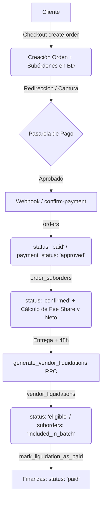

# INFORME DE AUDITORÍA COMPLETA — PAGOS, CANCELACIONES, REEMBOLSOS Y LIQUIDACIONES (MARKETPLACE)

Este reporte presenta los hallazgos del análisis técnico, funcional y financiero del sistema de pagos de Collectibles, realizado directamente contra el código de la base de datos (Supabase SQL/RLS), Edge Functions e integraciones con pasarelas de pago.

---

## FASE 1 — INVENTARIO Y CAPACIDADES DE PASARELAS

El análisis del código revela que el sistema implementa múltiples pasarelas, pero con niveles de cobertura asimétricos en cuanto a cancelaciones y reembolsos automáticos.

| Pasarela | Cobro | Captura | Cancelación | Refund Total | Refund Parcial | Webhooks | Estado Real de Implementación |
| :--- | :---: | :---: | :---: | :---: | :---: | :---: | :--- |
| **Mercado Pago** | ✅ Sí | ✅ Sí | ✅ Sí | ✅ Sí | ❌ No | ✅ Sí | **Activo**. Webhook cuenta con verificación de firma HMAC-SHA256 (si se configura secret). El reembolso total automático funciona vía API. Reembolso parcial no implementado. |
| **PayPal** | ✅ Sí | ✅ Sí | ✅ Sí | ✅ Sí | ❌ No | ❌ No | **Activo**. Captura y reembolso total integrados mediante llamadas API sincrónicas. No utiliza webhooks; la actualización de estado ocurre por retorno del cliente al frontend/Edge Function. |
| **Handy** | ✅ Sí | ✅ Sí | ❌ No | ❌ No | ❌ No | ✅ Sí | **Incompleto**. Permite cobros y recibe confirmación mediante webhook, pero la cancelación y el reembolso no están integrados vía API (deben realizarse de forma manual). |
| **dLocal Go** | ✅ Sí | ✅ Sí | ❌ No | ❌ No | ❌ No | ✅ Sí | **Incompleto**. Permite cobros y recibe confirmaciones mediante webhook firmado por HMAC. La cancelación y el reembolso no están integrados vía API (deben realizarse de forma manual). |
| **Transferencia / Mock**| ✅ Sí | ✅ Sí | ✅ Sí | ✅ Sí | ❌ No | ➖ N/A | **Simulado**. Se cancelan los registros y se restaura el stock únicamente a nivel local (base de datos), sin interacción externa. |

---

## FASE 2 — AUDITORÍA DEL FLUJO DE PAGO Y DE ESTADOS

El ciclo de vida del dinero y las actualizaciones de estados se estructuran de la siguiente manera:



### Hallazgos del Flujo
1. **Verificación de Precios y Stock**: La Edge Function [create-order](file:///c:/Projects/Collectibles2026/supabase/functions/create-order/index.ts) y la función de base de datos [create_order_atomic](file:///c:/Projects/Collectibles2026/supabase/migrations/20261025000000_multi_store_vendor.sql#L558-L754) verifican el precio real y el stock del producto aplicando bloqueos a nivel de fila (`FOR UPDATE`).
2. **Cálculo de Comisión de Pasarela (Fee Share)**: Al confirmarse el pago (en [finalizeOrderIfNeeded](file:///c:/Projects/Collectibles2026/supabase/functions/_shared/order-payments.ts#L131-L225)), el sistema calcula de forma proporcional el costo financiero de la pasarela para cada suborden mediante la fórmula:
   $$\text{payment\_fee\_share} = \frac{\text{total\_payment\_fee} \times \text{suborder\_total}}{\text{order\_total}}$$
3. **Cálculo Neto del Vendedor**: El valor neto final a transferir se calcula como:
   $$\text{vendor\_net\_amount} = \text{product\_subtotal} + \text{shipping\_cost} - \text{marketplace\_fee} - \text{payment\_fee\_share}$$
4. **Liquidación Semanal**: La función [generate_vendor_liquidations](file:///c:/Projects/Collectibles2026/supabase/migrations/20260913000000_liquidation_payouts_rpc.sql#L6-L175) procesa de forma agrupada los netos de los vendedores tras 48 horas de entregados los pedidos y si no hay reclamos abiertos en la tabla `order_disputes`.

---

## FASE 3 — CANCELACIÓN DE PAGO

* **Mecanismo**: Existe un botón de cancelación en el panel de administrador ([AdminOrders.tsx](file:///c:/Projects/Collectibles2026/frontend/src/pages/admin/AdminOrders.tsx#L1034-L1045)) que, al ejecutarse en una orden con estado `'paid'`, llama a la Edge Function [refund-order](file:///c:/Projects/Collectibles2026/supabase/functions/refund-order/index.ts).
* **Comportamiento real de la API**:
  * Para **Mercado Pago** y **PayPal**, la función ejecuta una llamada HTTP directa a los servidores de la pasarela para realizar el reverso.
  * Para **Handy** y **dLocal Go**, no se invoca ninguna API. El sistema imprime el log `No refund needed (mock/transfer/other). Cancelling directly.` y actualiza el estado interno de la orden a `'cancelada'` sin devolver el dinero de forma automatizada.
* **Manejo de Errores**: Si la API del proveedor falla, el campo `refundSuccess` retorna `false` y el error se muestra en el Admin. Sin embargo, la orden local **se actualiza igualmente a `'cancelada'`** en la base de datos, lo que produce una desincronización grave (dinero en manos del marketplace, pero orden reportada como cancelada en el sistema).

---

## FASE 4 — REFUND TOTAL (REEMBOLSO TOTAL)

* **Flujo**: El reembolso total está implementado únicamente para Mercado Pago y PayPal.
* **Acción en Base de Datos**:
  * Actualiza la tabla `orders` cambiando `status = 'cancelada'`.
  * Restaura el stock de los productos vendidos incrementando el contador en la tabla `product_variants`.
* **Vulnerabilidades y Vacíos**:
  * **No actualiza la tabla `payments`**: El estado de la transacción original en la tabla `payments` sigue figurando como `'approved'` tras el reembolso.
  * **No actualiza las Subórdenes**: El estado en la tabla `order_suborders` no se modifica (se mantiene en su estado original, ej: `'confirmed'`).

---

## FASE 5 — REFUND PARCIAL (REEMBOLSO PARCIAL)

* **Soporte de API**: Las APIs de Mercado Pago y PayPal admiten reembolsos parciales enviando el parámetro `amount`.
* **Estado en la App**: **No está implementado**. La Edge Function [refund-order](file:///c:/Projects/Collectibles2026/supabase/functions/refund-order/index.ts) no acepta argumentos de monto ni pasa cuerpo de carga en la llamada de reembolso de Mercado Pago o PayPal.
* **Cálculo Financiero**: No existe lógica para recalcular comisiones de marketplace, fee de pasarela ni reajustes de balances para liquidaciones cuando ocurre una devolución parcial.

---

## FASE 6 — SUBORDERS (SUBÓRDENES)

* **Cancelación Individual**: **No está soportada**. El panel de administración obliga a cancelar la orden completa. No hay endpoints ni funciones de base de datos preparadas para realizar la cancelación o devolución de una única suborden.
* **Impacto**: Si en un carrito con productos de múltiples vendedores uno de ellos no puede cumplir con el envío, se debe cancelar la compra de todos los vendedores de forma obligatoria o intervenir manualmente la base de datos, lo cual arriesga la integridad de los saldos.

---

## FASE 7 — LIQUIDACIONES (PAGOS A VENDEDORES)

Existe un **vacío crítico de seguridad financiera** en el orden de operaciones:

```
Suborden entregada 
   ↓
Se ejecuta generate_vendor_liquidations() 
   ↓
El Admin marca la liquidación como 'paid' (dinero transferido al banco del vendedor)
   ↓
El cliente solicita una devolución / cancelación del pedido
   ↓
El Admin hace clic en "Cancelar Orden y Reembolsar" en AdminOrders.tsx
   ↓
[CRÍTICO] La Edge Function 'refund-order' procesa el reembolso completo al cliente 
          sin verificar si los fondos de ese pedido ya fueron transferidos al vendedor.
```

### Consecuencia
El cliente recibe su dinero de vuelta y el vendedor mantiene los fondos ya liquidados. **La plataforma absorbe el 100% de la pérdida financiera**. No existen mecanismos para generar saldos negativos, retenciones o alertas de bloqueo de reembolsos para órdenes ya liquidadas.

---

## FASE 8 — COMISIONES

* **Distribución de Costos de Reembolso**:
  * Si la orden se cancela **antes** de liquidar: Las subórdenes quedan congeladas en estado de liquidación `'pending'` (ya que la orden padre cambia a `'cancelada'` y no es elegible en el RPC de liquidaciones). La plataforma no cobra comisión y la pasarela devuelve la porción variable (sujeto a políticas del proveedor).
  * Si la orden se cancela **después** de liquidar: El vendedor conserva su neto y el comprador recibe el importe total. La plataforma pierde el costo del producto, el costo de envío y la comisión de pasarela.

---

## FASE 9 — AUDITORÍA DE WEBHOOKS

* **Mercado Pago (`mercadopago-webhook`)**:
  * Procesa: `approved`, `authorized` (marca orden como `'paid'`, calcula comisiones y logística) y `cancelled`, `rejected` (marca orden como `'cancelled'`).
  * **Ignora**: `refunded` y `charged_back` (contracargos).
* **Handy Webhook (`handy-webhook`)**:
  * Procesa y mapea: `approved`, `rejected`, `cancelled`, `refunded`, `pending`, `failed`. Actualiza la tabla `payments`.
  * Si el estado es cancelado, actualiza la orden.
* **dLocal Go Webhook (`dlocalgo-webhook`)**:
  * Procesa: `PAID` / `APPROVED` (aprobado) y `REJECTED` / `CANCELLED` (cancelado).
  * **Ignora**: Estados de devolución o chargebacks.

---

## FASE 10 — CHARGEBACKS (CONTRACARGOS)

* **Soporte de Base de Datos**: No existen tablas específicas para contracargos ni campos de trazabilidad de disputas bancarias directas.
* **Soporte de API / Webhooks**: Ninguno de los webhooks está programado para reaccionar ante notificaciones de contracargo/fraude enviadas por las pasarelas. Si un cliente inicia un contracargo en Mercado Pago, el sistema de Collectibles mantiene el pedido como `'paid'` y continúa con el proceso de liquidación al vendedor de manera normal.

---

## FASE 11 & 12 — PANELES DE USUARIO (ADMIN vs VENDOR)

* **Panel Admin ([AdminOrders.tsx](file:///c:/Projects/Collectibles2026/frontend/src/pages/admin/AdminOrders.tsx))**:
  * ✅ Permite cancelar la orden y solicitar reembolso completo.
  * ❌ No permite reintentar reembolsos fallidos ni ver detalles estructurados de la respuesta de la API.
  * ❌ No permite cancelaciones parciales o por suborden.
* **Panel Vendor ([VOrders.tsx](file:///c:/Projects/Collectibles2026/frontend/src/components/vendor/VOrders.tsx) / [VFinances.tsx](file:///c:/Projects/Collectibles2026/frontend/src/components/vendor/VFinances.tsx))**:
  * ✅ Únicamente lectura. El vendedor puede ver el estado de preparación, datos de envío y el desglose de ingresos neto y bruto.
  * ✅ No dispone de ningún botón o acción para emitir cancelaciones o reembolsos, garantizando la seguridad operacional.

---

## FASE 13 — BASE DE DATOS: INTEGRIDAD Y TABLAS

Auditoría de existencia e integridad de los esquemas requeridos:

| Tabla | Estado | Observación / Integridad |
| :--- | :---: | :--- |
| `orders` | **Existente** | Almacena campos consolidados correctos. |
| `order_items` | **Existente** | Mapea correctamente el `suborder_id` y `vendor_id`. |
| `order_suborders` | **Existente** | Soporta liquidación y estado individual, pero sus estados no se actualizan al cancelar la orden padre. |
| `payments` | **Existente** | Almacena payloads. **Error**: No recibe actualizaciones tras la ejecución de reembolsos por parte de las Edge Functions. |
| `vendor_liquidations`| **Existente** | Controla el flujo de pagos semanales. |
| `vendor_payouts` | **Existente** | Almacena los comprobantes y referencias de pago manual de la administración. |
| `order_disputes` | **Existente** | Bloquea la liquidación de la suborden de manera correcta si hay disputas abiertas. |
| `refunds` | **Faltante** | **No existe**. Los datos del reembolso quedan dispersos entre el stdout de los logs de Supabase y el string en `delivery_notes` de la orden. |
| `payment_logs` | **Faltante** | **No existe**. |
| `audit_logs` | **Faltante** | **No existe**. |

---

## FASE 14 — EDGE FUNCTIONS: CÓDIGO MOCK Y ANÁLISIS DE CALIDAD

Se identificaron los siguientes comportamientos simulados o de prueba:
1. **Mercado Pago Mock Mode**: En [mercadopago-checkout](file:///c:/Projects/Collectibles2026/supabase/functions/mercadopago-checkout/index.ts#L126), si el token de acceso contiene la palabra `"mock"` o no existe, genera un ID de pago ficticio (`MP-MOCK-...`) y simula una redirección exitosa.
2. **dLocal Go Mock Mode**: En [dlocalgo-checkout](file:///c:/Projects/Collectibles2026/supabase/functions/dlocalgo-checkout/index.ts#L44), si la API Key es `'mock-dlocalgo-key'`, crea un ID de pago simulado (`DLG-MOCK-...`) y omite llamadas al servicio externo de dLocal.
3. **Refund Bypass**: En [refund-order](file:///c:/Projects/Collectibles2026/supabase/functions/refund-order/index.ts#L64-L74), se asume éxito de reembolso de forma directa si el ID del pago es de tipo Mock (`MP-MOCK`) o si el token contiene la palabra `"mock"`.

---

## FASE 15 — CASOS DE PRUEBA: ANÁLISIS DE COMPORTAMIENTO REAL

A partir del código analizado, se proyecta el siguiente comportamiento ante los escenarios descritos:

### Caso 1: Compra → Pago aprobado → Cancelar antes del envío
El reembolso vía API se procesa en Mercado Pago/PayPal. El stock de productos se incrementa exitosamente en `product_variants`. La orden padre cambia a `'cancelada'`. Las subórdenes quedan en estado `'confirmed'` en la base de datos, pero el RPC no las liquidará porque la orden padre ya no tiene el estado `'paid'`.
* **Resultado**: **Aprobado con observaciones de consistencia de datos** (subórdenes quedan huérfanas en estado `'confirmed'`).

### Caso 2: Compra → Pago aprobado → Refund total
El reembolso total se completa vía API. El stock se restaura. La orden cambia a `'cancelada'`. La tabla `payments` permanece en estado `'approved'` (no se registra el evento del reembolso). Las subórdenes no se actualizan a `'refunded'`.
* **Resultado**: **Aprobado con observaciones de trazabilidad**.

### Caso 3: Compra → Refund parcial
La Edge Function no acepta parámetros de montos y las pasarelas no reciben instrucciones de devolución parcial.
* **Resultado**: **No soportado**.

### Caso 4: Pedido multivendor → Refund solo Vendor A
El sistema no puede aislar subórdenes para devoluciones parciales. Se debe cancelar el pedido completo, afectando la venta de los demás vendedores (ej: Vendor B).
* **Resultado**: **No soportado**.

### Caso 5: Vendor ya liquidado → Refund
El sistema procesa el reembolso completo al cliente sin restricciones. El dinero ya transferido al vendedor no se puede recuperar ni se genera un balance negativo para la siguiente semana.
* **Resultado**: **Falla crítica con pérdida de fondos para el marketplace**.

### Caso 6: Chargeback → Actualizar estados
Los webhooks omiten el procesamiento de estados de contracargo y mediación. La orden continúa marcada como `'paid'` y el vendedor puede ser liquidado normalmente por un dinero que el marketplace ya perdió.
* **Resultado**: **No soportado / Riesgo alto de fraude**.

---

## FASE 16 — SEGURIDAD (AUTORIZACIÓN Y RLS)

* **Seguridad en API**: La Edge Function `refund-order` valida la identidad del emisor mediante `verifyAdmin(req)`, impidiendo llamadas anónimas o de usuarios convencionales.
* **Seguridad en DB**: RLS (Row Level Security) está habilitado correctamente. Los vendedores tienen políticas de actualización limitadas únicamente a sus propios registros de subórdenes (ej: modificar estados de envío o tracking) y carecen de privilegios de escritura en las tablas de `orders`, `payments`, `vendor_liquidations` or `vendor_payouts`.
* **Veredicto**: **Seguro**. Los controles de acceso impiden que agentes externos o vendedores maliciosos manipulen cancelaciones o pagos.

---

## FASE 17 — HISTORIAL Y AUDITORÍA DE ACCIONES

* **Bitácora**: No existe una tabla de logs financieros o de auditoría.
* **Trazabilidad actual**:
  * Se registra un resumen simple de la cancelación en formato de texto concatenado dentro de `orders.delivery_notes`.
  * La IP del usuario administrador que ejecuta la acción, el estado exacto anterior de la orden y la respuesta completa de la API del proveedor no se almacenan de forma permanente.
* **Veredicto**: **Insuficiente**.

---

## FASE 18 — ANÁLISIS DE RIESGOS

### 🚨 RIESGOS CRÍTICOS

1. **Reembolso a cliente de órdenes ya liquidadas al Vendedor**
   * **Descripción**: Se permite reembolsar un pedido cuyo neto ya fue transferido al vendedor. La plataforma absorbe el 100% de la pérdida financiera.
   * **Mitigación recomendada**: Bloquear reembolsos automáticos en `refund-order` si alguna suborden asociada tiene `liquidation_status = 'paid'`. Requerir aprobación de nivel superior y generar de forma automática un débito/ajuste en la cuenta del vendedor en la tabla de liquidaciones.

2. **Inexistencia de reembolsos automáticos para Handy y dLocal Go**
   * **Descripción**: Al cancelar un pedido pagado mediante Handy o dLocal Go, el sistema cambia la orden a `'cancelada'` localmente sin llamar a ninguna API de devolución. Si el administrador asume que el reverso fue automático, el cliente nunca recibirá su reembolso.
   * **Mitigación recomendada**: Implementar los endpoints de devolución de Handy y dLocal Go dentro de la Edge Function [refund-order](file:///c:/Projects/Collectibles2026/supabase/functions/refund-order/index.ts). Si el reembolso automático no está implementado para ese proveedor, la API debe rechazar la cancelación automática y requerir confirmación manual previa.

### ⚠️ RIESGOS ALTOS

3. **Falta de soporte para reembolsos parciales y cancelaciones de subórdenes**
   * **Descripción**: No se puede cancelar ni reembolsar de manera individual un ítem o una suborden en pedidos multi-vendedor. Fuerza a la cancelación total de la compra o a manipulaciones directas en base de datos.
   * **Mitigación recomendada**: Diseñar un endpoint de reembolso parcial en la Edge Function que recalcule los impuestos, comisiones, montos de envío y actualice el estado de la suborden específica a `'refunded'` o `'cancelled'`.

4. **Omisión de Webhooks para Devoluciones y Chargebacks**
   * **Descripción**: Si un reembolso o disputa bancaria (contracargo) se genera externamente en el panel de Mercado Pago o dLocal, los webhooks no procesan esta información, manteniendo el pedido local como aprobado y permitiendo la liquidación indebida al vendedor.
   * **Mitigación recomendada**: Incorporar el mapeo de los estados `refunded`, `charged_back` e `in_mediation` en los webhooks de pago para suspender de inmediato el estado de liquidación de las subórdenes vinculadas.

### ℹ️ RIESGOS MEDIOS / BAJOS

5. **Inexistencia de Tabla de Auditoría y Logs Financieros**
   * **Descripción**: Los eventos de reembolsos no guardan la respuesta completa de la API del proveedor ni registran el identificador del administrador responsable de forma estructurada.
   * **Mitigación recomendada**: Crear una tabla `payment_logs` o `audit_logs` que registre de forma obligatoria las llamadas entrantes/salientes de pagos.

6. **Desincronización de Estados de Pago Local**
   * **Descripción**: La tabla `payments` y las subórdenes asociadas no cambian su estado al ejecutarse un reembolso total de la orden.
   * **Mitigación recomendada**: Ejecutar transacciones SQL que actualicen el estado en `payments` a `'refunded'` y en `order_suborders` a `'cancelled'` / `'refunded'` coordinadas con la cancelación de la orden.

---

## QUÉ FALTA IMPLEMENTAR (PRIORIZADO POR IMPACTO)

1. **Control de Liquidación en Reembolsos (Bloqueo)**: Validación en la Edge Function para evitar reembolsar si el estado de liquidación de las subórdenes no es `'pending'`.
2. **Integración de Reembolsos para Handy y dLocal Go**: Desarrollar la integración con la API de Handy y la API de dLocal Go para procesar cancelaciones automáticas.
3. **Mapeo de Chargebacks y Contracargos**: Implementar los manejadores de estado en los webhooks para bloquear liquidaciones y registrar disputas bancarias.
4. **Devoluciones Parciales y por Suborden**: Estructurar la cancelación y devolución individualizada para el entorno marketplace.
5. **Tabla de Auditoría y Logs de Reembolsos**: Persistencia de logs transaccionales detallados.

---

## VERDICTO FINAL

### ❌ NOT READY

**Razón**: El sistema soporta cobros y liquidaciones semanales robustas, pero carece de la lógica de reverso financiera segura requerida para operar en producción bajo un modelo de Marketplace Multi-Vendor. Procesar un reembolso sobre una suborden previamente liquidada resulta en pérdidas económicas directas y descontroladas para el marketplace, y las cancelaciones de pasarelas como Handy y dLocal Go están completamente desconectadas a nivel de backend.
