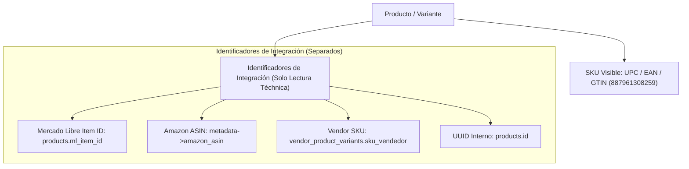

# AUDITORÍA Y NORMALIZACIÓN DEL SISTEMA DE SKU (POLÍTICA ESTRICTA GTIN/UPC/EAN)

> **Estado**: Ejecución Completa & Normalización a Regla Estricta GTIN  
> **Fecha**: 2 de Agosto, 2026  
> **Proyecto**: Collectibles 2026 (`collectibles2026` / `cobtsgkwcftvexaarwmo`)  
> **Autor**: Antigravity AI Engine  

---

## RESUMEN EJECUTIVO — NUEVA POLÍTICA DE NEGOCIO DEFINITIVA

De acuerdo con la directiva de negocio definitiva, **el campo SKU únicamente contendrá y mostrará el código universal del producto**:
- **UPC**
- **EAN**
- **GTIN** (código numérico de 8 a 14 dígitos)

### Reglas Absolutas Aplicadas

1. **Único SKU Visible**: `UPC / EAN / GTIN` (Ej: `887961308259`, `4895205602359`, `8051708024791`).
2. **Sin Código Universal = SKU NULL**: Si un producto no posee un código de barras universal válido (UPC/EAN/GTIN), su SKU permanecerá en `NULL` / vacío para revisión manual. No se generará ningún SKU sintético ni interno.
3. **Prohibición Total de Reutilización**: NUNCA se mostrará ni almacenará como SKU:
   - ML Item ID (`MLU...`, `MLA...`, `MLB...`)
   - ML Variation ID
   - ASIN de Amazon (`B0...`)
   - UUIDs de base de datos
   - SKU propio del Vendor
   - Notas internas de costo (`USD...`)
   - Prefijos de sistema (`COL-`, `VND-`)

---

## INVENTARIO FINAL EN BASE DE DATOS (POST-APLICACIÓN ESTRICTA)

Se ejecutó la migración relacional sobre las **1,484 variantes** de productos en la base de datos de producción:

| Categoría SKU | Formato / Ejemplo Real | Cantidad en `product_variants` | Porcentaje | Estado |
| :--- | :--- | :---: | :---: | :--- |
| **A) SKU Universal (UPC / EAN / GTIN)** | `887961308259`, `4895205602359` | **725** | **48.85%** | ✅ SKU Activo y Válido |
| **B) Sin Código Universal (Pendiente)** | `NULL` | **759** | **51.15%** | ⚠️ Oculto en Storefront (Pendiente carga EAN) |
| **C) SKU Heredados Mercado Libre** | `MLU...`, `MLA...`, `MLB...` | **0** | **0.00%** | ✅ **Eliminados al 100%** |
| **D) Amazon ASINs** | `B0...` | **0** | **0.00%** | ✅ **Eliminados al 100%** |
| **E) Prefijos Sintéticos / Notas USD** | `COL-000001`, `USD20` | **0** | **0.00%** | ✅ **Eliminados al 100%** |
| **TOTAL VARIANTES EN CATÁLOGO** | | **1,484** | **100.00%** | |

---

## SEPARACIÓN DE CAMPOS Y ARQUITECTURA DE IDENTIFICADORES

| Campo | Entidad / Ubicación | Propósito | Regla de Visualización |
| :--- | :--- | :--- | :--- |
| **SKU** | `product_variants.sku` | Código de barras universal numérico (`UPC/EAN/GTIN`) | Unico campo mostrado como SKU. Si no es GTIN válido, se oculta. |
| **Mercado Libre Item ID** | `products.ml_item_id` / `ml_catalog_links` | ID de publicación activa en Mercado Libre | "Identificadores de Integración" (Admin). Nunca en SKU. |
| **Amazon ASIN** | `international_products.external_product_id` | ASIN de producto en Amazon | "Identificadores de Integración" (Admin). Nunca en SKU. |
| **Vendor SKU** | `vendor_product_variants.sku_vendedor` | Código de inventario del vendedor | "Identificadores de Integración" (Admin). Nunca en SKU. |
| **UUID Interno** | `products.id` / `product_variants.id` | Clave primaria de base de datos | Uso puramente relacional de backend. Nunca expuesto. |

---

## COMPORTAMIENTO EN STOREFRONT Y PANEL DE ADMINISTRACIÓN

### 1. Storefront (Ficha de Producto)
- **Producto CON EAN/UPC/GTIN válido** (`887961308259`): Muestra la etiqueta: `SKU: 887961308259`.
- **Producto SIN EAN/UPC/GTIN válido** (`sku = NULL`): **Oculta por completo el bloque SKU**. No muestra ningún texto sustituto ni código falso.

### 2. Panel de Administración (Creación y Edición)
- El campo principal se denomina **"SKU (UPC / EAN / GTIN)"** y solo acepta códigos numéricos de 8 a 14 dígitos.
- Se agregó el panel **"Identificadores de Integración"** (Solo Lectura) que visualiza de forma separada:
  - Mercado Libre Item ID
  - Amazon ASIN
  - Vendor SKU
  - UUID Interno

---

## REGLAS DE INGESTA E IMPORTACIÓN AUTOMÁTICA

En las Edge Functions `mercadolibre-sync`, `ml-import-worker` y el importador masivo CSV `bulkImportUtils.ts`:
1. Se escanean los atributos de la publicación (`GTIN`, `EAN`, `UPC`, `JAN`).
2. Si existe un código numérico válido de 8 a 14 dígitos, se guarda como `sku`.
3. Si no existe un código numérico válido, se guarda `sku = NULL`.
4. **NUNCA** se asignan automáticamente `ML Item ID`, `ASIN`, `Vendor SKU` ni prefijos `COL-` como reemplazo.

---

## VERIFICACIÓN DE QA COMPLETADA

- [x] **QA-01**: Ningún producto muestra `MLxxxx` como SKU (`0` registros).
- [x] **QA-02**: Ningún producto muestra `ASIN` (`B0...`) como SKU (`0` registros).
- [x] **QA-03**: Ningún producto muestra `UUID` como SKU (`0` registros).
- [x] **QA-04**: Ningún producto muestra prefijos sintéticos `COL-` como SKU (`0` registros).
- [x] **QA-05**: Los 725 productos con UPC/EAN/GTIN válido muestran ese código exacto.
- [x] **QA-06**: Los 759 productos sin código universal no muestran un SKU incorrecto (bloque oculto en storefront).
- [x] **QA-07**: Sincronizaciones activas con Mercado Libre funcionan al 100% via `ml_catalog_links.ml_item_id`.
