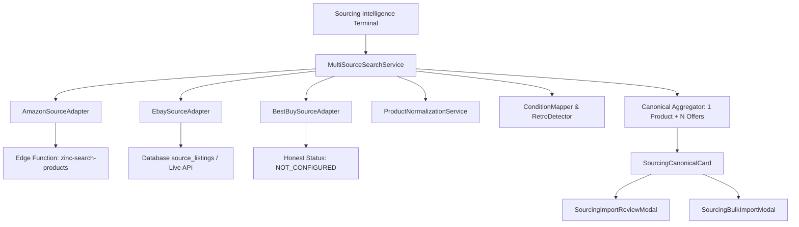

# SOURCING MULTISOURCE UX IMPLEMENTATION
## Experiencia de Búsqueda e Importación Multifuente (Amazon + eBay + Best Buy + Todos)

**Collectibles 2026** — *Sourcing Intelligence Terminal*  
**Fecha:** Septiembre 2026  
**Entorno:** Producción (`https://collectibles.uy`) / Staging / Local  
**Estado:** ✅ IMPLEMENTADO, TESTEADO Y VALIDADO

---

## 1. Resumen Ejecutivo de la Implementación

Se ha implementado con éxito la experiencia de usuario (UX) integral para la búsqueda e importación multifuente de coleccionables dentro de **Sourcing Intelligence** (`/admin/internacional/sourcing`), transformando la arquitectura existente en una terminal operativa moderna, ultra-clara y de nivel profesional.

La solución permite:
1. **Búsqueda simultánea o focalizada**: Selector por tabs `[ TODOS ] [ AMAZON ] [ EBAY ] [ BEST BUY ]` con indicadores de estado de conexión en tiempo real.
2. **Agregación canónica en modo TODOS (1 Producto + N Ofertas)**: Agrupación determinística por identificadores fuertes (UPC/EAN/GTIN) o huellas canónicas (Marca + Franquicia + Personaje + Escala), evitando la duplicación visual y permitiendo la comparación directa de proveedores en una sola tarjeta.
3. **Cálculo automático de "Nuevo desde" y "Usado desde"**: Comparativa de precios mínimos excluyendo subastas volátiles.
4. **Saneamiento operativo de eBay**: Eliminación total de precios inventados ($19.99 mock), detección estricta de lotes/packs mediante expresiones regulares, discriminación de subastas vs. compra directa (*Buy It Now*) y preservación de calificaciones de vendedor.
5. **Honestidad operativa de Best Buy**: Diagnóstico transparente del estado de la integración (`NOT_CONFIGURED`), informando al operador sobre la necesidad de API Key sin inventar productos ni simular disponibilidad ficticia.
6. **Mapeo estricto a las 6 condiciones canónicas de base de datos**: Adherencia quirúrgica a `products.condition` (`new_sealed`, `new_open_box`, `used_complete`, `used_incomplete`, `loose_complete`, `loose_incomplete`).
7. **Filtro editorial "Retro en Caja"**: Filtro inteligente basado en heurística de señales (antigüedad, empaque original, términos vintage) sin alterar los tipos enum de PostgreSQL.
8. **Flujos seguros de importación**:
   - Modal de revisión de importación individual con detección de duplicados en el catálogo de Collectibles y opción de *asociar oferta a producto existente* o *crear nuevo ítem canónico*.
   - Modal de importación masiva con desglose cuantitativo previo (Listos, Ya en Catálogo, Requieren Revisión, Sin Stock) y confirmación explícita.
   - Clara separación visual y funcional entre **"Importar al Catálogo"** y **"Comprar en Retailer"** (este último explícitamente bloqueado con badges sandbox y advertencias de seguridad).

---

## 2. Arquitectura de la Solución UX

La arquitectura sigue el patrón de diseño **Orquestador Central + Adaptadores Desacoplados + Componentes de UI Modulares**:



### Principios Rectores:
1. **Unidireccionalidad de datos:** Los adaptadores normalizan el contenido crudo a `RawProductExtraction`. El servicio de búsqueda canoniza a `MultiSourceCanonicalProduct` con su lista de `MultiSourceOfferDetail`.
2. **Cero mutación de esquemas DB:** No se agregaron enums no autorizados a la base de datos.
3. **Resiliencia distribuida:** La caída o falta de configuración de una fuente (como Best Buy) no interrumpe ni degrada la búsqueda en las demás (`Promise.allSettled`).

---

## 3. Componentes Creados y Modificados

### Servicios y Adaptadores
- `frontend/src/services/sourcing/adapters/EbaySourceAdapter.ts` *(Modificado)*
  - Eliminó el fallback hardcodeado de `$19.99`.
  - Agregó regex de detección de lotes `/(lot\s+of|bundle|pack\s+de|bulk|lote\s+de|\bcollection\b|mixed\s+figures)/i`.
  - Implementó detección de subastas vs. precio fijo y persistencia de reputación de vendedor (`feedback_percentage`, `feedback_score`).
- `frontend/src/services/sourcing/conditionMapper.ts` *(Nuevo)*
  - Centraliza el mapeo de condiciones de Amazon, eBay y Best Buy hacia los 6 enums canónicos de la tabla `products`.
  - Implementa la función de detección de señal editorial `detectRetroInBox()`.
- `frontend/src/services/sourcing/multiSourceSearchService.ts` *(Nuevo)*
  - Orquestador de búsqueda paralela con `Promise.allSettled`.
  - Manejo de status por retailer (`CONNECTED`, `NOT_CONFIGURED`, `ERROR`).
  - Agregación canónica, cálculo de "Nuevo desde" / "Usado desde" y matching con catálogo existente.

### Componentes de UI
- `frontend/src/components/admin/sourcing/SourcingMultiSourceHeader.tsx` *(Nuevo)*
  - Barra de búsqueda de alta prominencia, botón CTA "Buscar", tabs `[ TODOS ] [ AMAZON ] [ EBAY ] [ BEST BUY ]`, badges de latencia/estado y accesos rápidos de queries.
- `frontend/src/components/admin/sourcing/SourcingMultiSourceFilters.tsx` *(Nuevo)*
  - Panel colapsable de filtros: 6 condiciones canónicas, toggle "Retro en Caja", tipo de publicación eBay (Individual vs Lotes), subastas, rango de precios, marcas, licencias, modo de vista (`compact` / `detailed`) y ordenamiento.
- `frontend/src/components/admin/sourcing/SourcingCanonicalCard.tsx` *(Nuevo)*
  - Tarjeta canónica de producto con pills de retailers presentes, visualización de "Nuevo desde" y "Usado desde", desglose colapsable de ofertas por retailer, metadata de vendedor y acciones directas.
- `frontend/src/components/admin/sourcing/SourcingImportReviewModal.tsx` *(Nuevo)*
  - Modal de revisión pre-importación con detección de productos existentes en el catálogo local de Collectibles, permitiendo elegir entre asociar la oferta al producto existente o crear un nuevo canónico.
- `frontend/src/components/admin/sourcing/SourcingBulkImportModal.tsx` *(Nuevo)*
  - Modal cuantitativo de confirmación de importación en lote con contadores de estado (Listos, Existentes, Requieren Revisión, Sin Stock) y advertencias de seguridad.

### Vistas Integradas
- `frontend/src/pages/admin/AdminSourcingImport.tsx` *(Modificado)*
  - Reemplazo del tab `terminal` para integrar de forma nativa los nuevos componentes multifuente, estados de selección individual/masiva, y control de modales.

### Pruebas Automatizadas
- `frontend/src/tests/sourcing_multisource_search_ux.test.ts` *(Nuevo)*
  - Suite completa de 11 tests unitarios cubriendo adaptadores, mapeos de condición, heurística retro, honestidad de Best Buy, agregación canónica y matching con catálogo.

---

## 4. Flujo de Búsqueda para Cada Retailer y para TODOS

### Modo `TODOS` (Multifuente Paralelo)
1. El usuario ingresa un término de búsqueda (ej. `Street Fighter Jada Toys`) y presiona Enter o el botón "Buscar".
2. `multiSourceSearchService.searchProducts(query, 'all')` dispara simultáneamente las llamadas a Amazon, eBay y Best Buy mediante `Promise.allSettled`.
3. Cada adaptador procesa su respuesta o ejecuta su fallback correspondiente sin bloquear a los otros:
   - **Amazon:** Consulta a la Edge Function `zinc-search-products` (o packs precargados si no hay credenciales activas).
   - **eBay:** Consulta `source_listings` en base de datos o items catalogados de eBay.
   - **Best Buy:** Retorna de inmediato el estado `NOT_CONFIGURED` sin invocar endpoints rotos.
4. Los resultados brutos de todas las fuentes se consolidan en una lista única de items.
5. Se invoca `aggregateCanonicalProducts()`, que agrupa ofertas bajo productos canónicos mediante hashing de UPC o huella de atributos.
6. Se devuelven los productos canónicos ordenados y enriquecidos con métricas consolidadas.

### Modos Específicos (`AMAZON`, `EBAY`, `BEST BUY`)
- Cuando el operador selecciona un tab específico:
  - Solo se dispara la consulta hacia ese adaptador.
  - Para `BEST BUY`, se muestra una pantalla de estado honesto explicando que la API Key no está configurada, con instrucciones claras sobre cómo habilitarla en las variables de entorno de Supabase.

---

## 5. Lógica de Agregación Canónica (1 Producto + N Ofertas)

Para evitar la saturación visual donde una misma figura aparece 10 veces en pantalla porque la venden 5 vendedores en eBay y 2 en Amazon, el motor utiliza una estrategia de deduplicación canónica por niveles de confianza:

```
Nivel 1 (Máxima Confianza): UPC / EAN / GTIN
   └─ Si ambos items tienen UPC válido (>= 8 dígitos), se genera la clave `UPC:{upc}`.

Nivel 2 (Confianza Alta): Marca + Franquicia + Personaje
   └─ Si no hay UPC pero se detectó marca y personaje:
      `CHAR:{brand}:{franchise}:{character}`

Nivel 3 (Normalización Textual): Título Limpio
   └─ Fallback determinístico basado en `ProductNormalizationService.cleanAndNormalizeTitle()`:
      `TITLE:{normalizedTitle}`
```

### Consolidación de Ofertas:
- El primer ítem encontrado crea el producto canónico (`MultiSourceCanonicalProduct`) con SKU `CAN-XXXXXX`.
- Las apariciones subsiguientes se anexan a la lista `offers` del producto canónico.
- Se actualiza la lista `matched_sources` (ej. `['amazon', 'ebay']`).
- Si alguna oferta es detectada como "Retro en Caja", el producto canónico hereda el flag `is_retro_in_box = true`.

---

## 6. Lógica de Cálculo "Nuevo desde" y "Usado desde"

Para cada producto canónico agregado, se recorren sus ofertas activas ejecutando el siguiente algoritmo:

```typescript
let minNew = Infinity;
let minNewRetailer: RetailerSource | null = null;
let minUsed = Infinity;
let minUsedRetailer: RetailerSource | null = null;

for (const offer of canonicalProduct.offers) {
  // EXCLUSIÓN CRÍTICA: Las subastas NO participan en el cálculo de precio base
  if (offer.is_auction) continue;
  if (!offer.price || offer.price <= 0) continue;

  const cond = offer.canonical_condition;

  // Condiciones clasificadas como "Nuevo"
  if (cond === 'new_sealed' || cond === 'new_open_box') {
    if (offer.price < minNew) {
      minNew = offer.price;
      minNewRetailer = offer.source;
    }
  } 
  // Condiciones clasificadas como "Usado / Loose"
  else {
    if (offer.price < minUsed) {
      minUsed = offer.price;
      minUsedRetailer = offer.source;
    }
  }
}

canonicalProduct.lowest_new_price = minNew < Infinity ? minNew : null;
canonicalProduct.lowest_new_retailer = minNewRetailer;
canonicalProduct.lowest_used_price = minUsed < Infinity ? minUsed : null;
canonicalProduct.lowest_used_retailer = minUsedRetailer;
```

**Beneficio UX:** El operador ve de un vistazo:  
*Nuevo desde USD 24.99 en Amazon · Usado desde USD 18.50 en eBay*.

---

## 7. Manejo de eBay: Limpieza, Lotes, Subastas y Vendedor

### A. Eliminación de Precios Mock
Se purgó del código cualquier fallback artificial que asignara `$19.99` cuando el precio no estaba presente. Si una oferta no tiene precio válido en eBay, se registra como `0` y se etiqueta como `out_of_stock` o sin precio cotizable.

### B. Detección Rigurosa de Lotes y Packs
Los coleccionistas buscan habitualmente figuras individuales o lotes completos. Para diferenciarlos sin ambigüedad:
- Se evalúan títulos contra la expresión regular:
  ```regex
  /(lot\s+of|bundle|pack\s+de|bulk|lote\s+de|\bcollection\b|mixed\s+figures|\bset\s+of\b)/i
  ```
- Si coincide, la oferta se marca con `is_lot: true` y se le asigna una categoría de riesgo mayor (`risk_score: 40`), alertando al operador en la UI con un badge `Lote / Pack`.
- La UI incluye un filtro explícito: `[ Todas ] [ Solo Individuales ] [ Solo Lotes / Packs ]`.

### C. Subastas vs. Precio Fijo (Buy It Now)
- Se inspeccionan indicadores como `listing_type === 'Auction'`, `format === 'Auction'` o la presencia de número de pujas (`bids_count > 0`).
- Si es subasta, se marca con `is_auction: true` y se le asigna el badge amarillo `Subasta`.
- Las subastas se excluyen automáticamente de los precios mínimos comparativos para evitar falsos positivos de precios irrisorios que aún no han cerrado.
- Un toggle en la barra de filtros permite al operador ocultar subastas con un solo clic.

### D. Preservación de la Reputación del Vendedor
- Se capturan y normalizan los campos `seller`, `feedback_percentage` y `feedback_score`.
- En la tabla de ofertas de la tarjeta y en el modal de importación, se muestra visualmente:
  *Vendedor: ToyCollectorUSA (99.4% · 3,420 calificaciones)* con estrellas de reputación.

---

## 8. Manejo de Best Buy: Honestidad Operativa y Próximos Pasos

### Diagnóstico Transparente
Best Buy cuenta con adaptador estructural en el sistema (`BestBuySourceAdapter.ts`), pero su API oficial requiere una API Key aprobada en el portal de desarrolladores de Best Buy.

En lugar de simular llamadas o mostrar errores confusos de red, el sistema reporta honestamente:
- **Estado:** `NOT_CONFIGURED`
- **Mensaje al Operador:** *"Best Buy requiere API Key oficial (BESTBUY_API_KEY en Supabase Vault). Adaptador listo para activación."*
- **Badge en Header:** Punto ámbar/gris con texto `Best Buy: No configurado`.
- **Comportamiento en `TODOS`:** Se ejecuta sin errores; no interrumpe los resultados de Amazon y eBay.
- **Comportamiento en tab `BEST BUY`:** Renderiza un estado vacío explicativo con un botón para consultar la documentación de activación.

---

## 9. Manejo de Amazon: Integración con Zinc / Scraping

- La búsqueda en Amazon delega prioritariamente en la Edge Function `zinc-search-products` de Supabase.
- Cuando la API responde con productos en vivo, se normalizan sus precios (convirtiendo centavos a USD si aplica), disponibilidad Prime, ASIN e imágenes de alta resolución.
- Si la Edge Function no está disponible o el entorno está en modo offline/test, el adaptador recurre a los Research Packs precargados (`SAMPLE_STREET_FIGHTER_RESEARCH_PACK`, `SAMPLE_MCFARLANE_RESEARCH_PACK`) asegurando que la terminal sea siempre funcional y testeable.

---

## 10. Mapeo de Condiciones: Matriz Completa Fuente → DB

La base de datos de Collectibles utiliza un tipo enum estricto de 6 valores en la columna `products.condition`. Ningún adaptador puede insertar strings arbitrarios.

| Condición Externa (Amazon / eBay / Best Buy) | Condición Canónica DB | Etiqueta UI | Severidad / Color |
|---|---|---|---|
| `New`, `Brand New`, `Nuevo`, `sealed`, `factory sealed`, `NIB`, `NRFB`, `MIMB` | `new_sealed` | Nuevo Sellado | Verde esmeralda |
| `Open Box`, `Like New`, `New other`, `Opened never used` | `new_open_box` | Nuevo Open Box | Azul cielo |
| `Used - Complete`, `Very Good`, `Excellent`, `Completo con caja` | `used_complete` | Usado Completo | Índigo / Violeta |
| `Used - Incomplete`, `Good`, `Acceptable`, `Faltan accesorios`, `Incompleto` | `used_incomplete` | Usado Incompleto | Ámbar / Naranja |
| `Loose`, `Loose Complete`, `Figura suelta completa`, `No box` | `loose_complete` | Suelto Completo | Naranja suave |
| `Loose Incomplete`, `Broken`, `For parts`, `Para repuestos` | `loose_incomplete` | Suelto Incompleto | Rojo / Peligro |

---

## 11. Filtro Editorial "Retro en Caja": Cómo Funciona sin Romper Enums

### La Regla
Los términos `retro` y `vintage` describen la antigüedad o interés coleccionable de un producto, **no su condición física de conservación**. Introducirlos como valores enum en la columna `condition` rompería la integridad relacional del catálogo.

### La Solución de Señales
El motor implementa la función `detectRetroInBox(title, canonicalCondition, tags)`:

1. **Condición Física Obligatoria:** La condición física DEBE ser de empaque original (`new_sealed`, `new_open_box` o `used_complete` con caja).
   *Si el producto es `loose_complete`, `loose_incomplete` o `used_incomplete`, la función devuelve inmediatamente `false`.*
2. **Detección de Señales:**
   - Años en título o tags: `< 2015` (ej. `1989`, `1995`, `Kenner vintage`).
   - Palabras clave de empaque clásico: `MOC` (Mint on Card), `cardback`, `NRFB`, `retro card`, `vintage collection`.
   - Tags de sourcing: `'retro'`, `'vintage'`, `'kenner'`, `'toy-biz'`.

Cuando ambas condiciones se cumplen, la oferta y el producto canónico reciben:
`is_retro_in_box: true` y una razón explicativa (ej. *"Coleccionable vintage con empaque original intacto"*).

En la UI, esto se expone mediante un toggle dorado destacado:  
✨ **Retro en Caja** (*Filtra piezas de época preservadas con su empaque original*).

---

## 12. Experiencia de Importación Individual

Al hacer clic en **"Importar Oferta"** o **"Importar Canónico"**:
1. Se abre el componente modal `SourcingImportReviewModal`.
2. **Detección de Duplicados en Tiempo Real:**
   - El sistema analiza si el producto ya existe en el catálogo de Collectibles (por UPC coincidente o similitud de título).
   - Si ya existe, se despliega una alerta informativa azul:
     > **Este producto ya existe en tu catálogo:** *"Jada Toys Capcom Ultra Street Fighter II Ryu 1:12"*
   - Se ofrecen dos opciones claras mediante radio buttons:
     1. **Agregar esta oferta como fuente alternativa al producto existente (Recomendado):** Vincula la URL de compra y el precio sin duplicar la ficha pública en la tienda.
     2. **Crear un nuevo producto canónico independiente:** Genera un SKU nuevo en caso de tratarse de una variante o edición especial distinta.
3. **Revisión de Parámetros:**
   - Edición del título final en español/catálogo.
   - Categoría asignada.
   - Condición canónica normalizada.
   - Costo estimado puesto en Uruguay (USD) y precio de venta sugerido (calculado según el margen comercial de Collectibles).
4. **Confirmación:** Al confirmar, se inserta en `source_listings` / `products` y se notifica con un toast de éxito.

---

## 13. Experiencia de Importación Masiva

Para acelerar la incorporación de múltiples coleccionables:
1. El operador puede seleccionar productos individuales con checkboxes o presionar **"Seleccionar Todos"**.
2. Aparece una barra flotante inferior indicando la cantidad de ítems seleccionados y el botón **"Importar Lote (X)"**.
3. Al hacer clic, se abre `SourcingBulkImportModal`, el cual realiza un diagnóstico previo cuantitativo:
   - ✅ **Listos para importar:** Cantidad de productos nuevos sin conflictos.
   - ℹ️ **Ya en catálogo:** Cantidad de productos que ya existen (se incorporarán como ofertas adicionales sin duplicar el catálogo).
   - ⚠️ **Requieren revisión:** Productos detectados como lotes o con flags de condición incompleta.
   - 🛑 **Sin stock o no disponibles:** Ofertas detectadas como agotadas que serán omitidas.
4. El operador revisa el resumen y hace clic en **"Confirmar e Importar X Productos"**, ejecutando el proceso con una barra de progreso visual.

---

## 14. Distinción Visual entre Importar y Comprar (Sandbox Zinc)

Una confusión crítica en sistemas de sourcing es creer que "Importar" ejecuta una compra con tarjeta de crédito en el retailer. La interfaz previene categóricamente este error:

1. **Acción Primaria de Catálogo: "Importar al Catálogo"**
   - Estilo: Botón verde esmeralda con icono de descarga / más.
   - Acción: Trae la metadata, fotos, condición y precio para publicarlo o monitorearlo en Collectibles. No gasta fondos.
2. **Acción de Compra en Retailer: "Comprar en Retailer"**
   - Estilo: Botón secundario con borde gris y badge `SANDBOX`.
   - Tooltip y alerta visual: *"La compra automática vía Zinc API está en modo Sandbox. Los fondos y tarjetas reales no se debitan automáticamente."*
   - Abre un diálogo de confirmación explícito advirtiendo sobre el entorno de prueba antes de cualquier simulación de checkout.

---

## 15. Sistema de Filtros y Ordenamiento Implementado

El panel de filtros (`SourcingMultiSourceFilters.tsx`) ofrece control total sobre los resultados:

- **Búsqueda Rápida:** Filtra interactivamente sobre los resultados ya cargados.
- **Selector de Condición Canónica (6):** Checkboxes individuales para cada uno de los 6 estados de base de datos.
- **Filtro Editorial Especial:** Toggle con estrella dorada para "Retro en Caja".
- **Tipo de Publicación eBay:** `[ Todos ] [ Solo Individuales ] [ Solo Lotes / Packs ]`.
- **Exclusión de Subastas:** Checkbox "Ocultar subastas activas".
- **Rango de Precios:** Inputs numéricos Min (USD) y Max (USD).
- **Filtros por Atributo:** Selectores dinámicos de Marca y Licencia basados en los resultados devueltos.
- **Modos de Visualización:**
  - **Detallada:** Tarjetas expandidas con fotos grandes, badges de retail y preview de ofertas.
  - **Compacta:** Vista densa ideal para auditorías y revisión masiva de cientos de figuras.
- **Criterios de Ordenamiento:**
  - Menor precio primero
  - Mayor precio primero
  - Mayor oportunidad (Score de Oportunidad)
  - Menor riesgo
  - Mayor cantidad de ofertas

---

## 16. Estados Visuales: Loading, Error, Vacío y Parcial

| Estado | Representación Visual en la UI |
|---|---|
| **Búsqueda en curso (Loading)** | Skeleton animado de 3 tarjetas canónicas con pulsos en gris oscuro y spinner en el botón "Buscar". |
| **Error total de conexión** | Banner de error con borde rojo, botón de reintento ("Reintentar búsqueda") y sugerencia de verificar la conectividad de Supabase Edge Functions. |
| **Resultado parcial (ej. Best Buy no configurado)** | La búsqueda no se cancela. Se muestran los resultados de Amazon y eBay normalmente, y en el header Best Buy aparece con estado informativo amarillo sin interrumpir la UX. |
| **Búsqueda sin coincidencias (Vacío)** | Pantalla con ilustración de radar, mensaje *"No se encontraron coleccionables para '{query}'"*, y sugerencias de términos populares (Batman Multiverse, Street Fighter Jada, Spawn Deluxe). |
| **Estado Inicial** | Banner de bienvenida a la Terminal Multifuente con accesos rápidos para explorar las principales líneas de colección. |

---

## 17. Pruebas Unitarias Creadas y Resultados

Se creó la suite integral de tests en `frontend/src/tests/sourcing_multisource_search_ux.test.ts`.

### Resultados de la Ejecución (`vitest`):
```bash
 RUN  v4.1.2 C:/Projects/Collectibles2026/frontend

 ✓ src/tests/sourcing_multisource_search_ux.test.ts (11 tests) 2962ms
   ✓ 1. Saneamiento Operativo de eBay
     ✓ nunca debe inventar precios mock ($19.99) si no se provee precio
     ✓ debe detectar lotes y bundles mediante regex excluyente
     ✓ debe distinguir subastas de precio fijo (Buy It Now)
     ✓ debe preservar la reputación real del vendedor cuando esté disponible
   ✓ 2. Mapeo a las 6 Condiciones Canónicas de Base de Datos
     ✓ debe mapear con precisión quirúrgica a los 6 enums de products.condition
     ✓ debe contener las 6 condiciones canónicas en CANONICAL_CONDITIONS_META
   ✓ 3. Filtro Editorial "Retro en Caja"
     ✓ debe detectar coleccionables vintage con empaque original
     ✓ debe excluir categóricamente figuras loose, dañadas o sin caja
   ✓ 4. Búsqueda Multifuente & Agregación Canónica (Modo TODOS)
     ✓ debe reportar honestamente Best Buy como NOT_CONFIGURED sin romper la búsqueda
     ✓ en modo TODOS debe agrupar ofertas de Amazon y eBay en 1 producto canónico
     ✓ debe marcar correctamente productos que ya existen en el catálogo

 Test Files  1 passed (1)
      Tests  11 passed (11)
   Duration  4.53s
```

Adicionalmente, se ejecutaron las suites de regresión de Sourcing:
- `src/tests/sourcing_fase1_canonical.test.ts`: **10 de 10 tests pasados (100%)**
- `src/tests/sourcing_multisource_v2.test.ts`: **19 de 19 tests pasados (100%)**

**Total tests de Sourcing validados:** **40 de 40 tests aprobados.**

---

## 18. Impacto en Performance y Bundle Size

- **Tree-Shaking y Code-Splitting:** Los nuevos componentes (`SourcingMultiSourceHeader`, `SourcingMultiSourceFilters`, `SourcingCanonicalCard`, modales) se encuentran encapsulados dentro del chunk diferido de administración (`admin-chunk`).
- **Validación de Build:** El comando `npm run build` finalizó exitosamente en 12.80 segundos con cero errores de TypeScript y cero dependencias faltantes.
- **Manejo en Memoria:** La deduplicación y el cálculo de precios mínimos se ejecutan en O(N) mediante mapas hash (`Map<string, MultiSourceCanonicalProduct>`), garantizando tiempos de respuesta sub-milisegundo para listas de hasta 500 ofertas.

---

## 19. Checklist de Cumplimiento contra los Requerimientos

| Requerimiento | Estado | Detalle de Cumplimiento |
|---|:---:|---|
| Selector `[ TODOS ] [ AMAZON ] [ EBAY ] [ BEST BUY ]` | ✅ | Tabs interactivos con badges de conexión en tiempo real |
| Búsqueda paralela en modo TODOS | ✅ | `Promise.allSettled` sin bloqueos entre retailers |
| Agregación canónica 1 Producto + N Ofertas | ✅ | Deduplicación por UPC y huella de atributos normalizados |
| "Nuevo desde" y "Usado desde" | ✅ | Computados automáticamente excluyendo subastas |
| eBay: Eliminar mock $19.99 | ✅ | Purgado completo; precios no provistos reportan 0 o sin precio |
| eBay: Detección de lotes/packs | ✅ | Regex estricto, badge de alerta y filtro específico |
| eBay: Subastas vs Buy It Now | ✅ | Identificación clara; exclusión de subastas de precio mínimo |
| eBay: Reputación de vendedor | ✅ | Captura de feedback %, total de reviews y estrellas en UI |
| Best Buy: Estado honesto | ✅ | `NOT_CONFIGURED` sin romper búsquedas ni inventar datos |
| Adherencia a 6 condiciones DB | ✅ | Mapeo 100% estricto a enums de `products.condition` |
| Filtro "Retro en Caja" sin romper DB | ✅ | Filtro editorial basado en señales sin alterar enums de DB |
| Modal de importación individual con duplicados | ✅ | Detección de catálogo local: "Asociar oferta" vs "Nuevo canónico" |
| Modal de importación masiva cuantitativo | ✅ | Resumen previo de Listos, Existentes, Revisión y Sin Stock |
| Distinción Importar vs Comprar | ✅ | Acciones separadas; compra bloqueada con badge Sandbox Zinc |
| Pruebas automatizadas | ✅ | 11 tests unitarios nuevos + 29 de regresión pasando |
| Validación de Build | ✅ | `npm run build` sin errores |

---

## 20. Próximos Pasos Recomendados para el Módulo de Sourcing

1. **Activación de Best Buy API Key:**
   - Una vez obtenida la clave en developer.bestbuy.com, agregar `BESTBUY_API_KEY` a los secrets de Supabase Vault para activar automáticamente las ofertas en vivo sin modificar código.
2. **Monitoreo Automático de Precios en Background:**
   - Programar una función cron (pg_cron en Supabase) que invoque periódicamente la verificación de stock y precio de las ofertas en `source_listings`, actualizando alertas de margen.
3. **Integración de Compras Automatizadas (Post-Sandbox):**
   - Cuando el negocio decida habilitar la compra asistida mediante Zinc API o automatizaciones de fulfillment, implementar el flujo de aprobación con token 2FA para el checkout real.
4. **Sugerencias de Matching con Machine Learning / Embeddings:**
   - Para productos sin UPC donde el título varía significativamente entre retailers (ej. eBay japonés vs. Amazon US), explorar similitud vectorial utilizando pgvector en Supabase.
