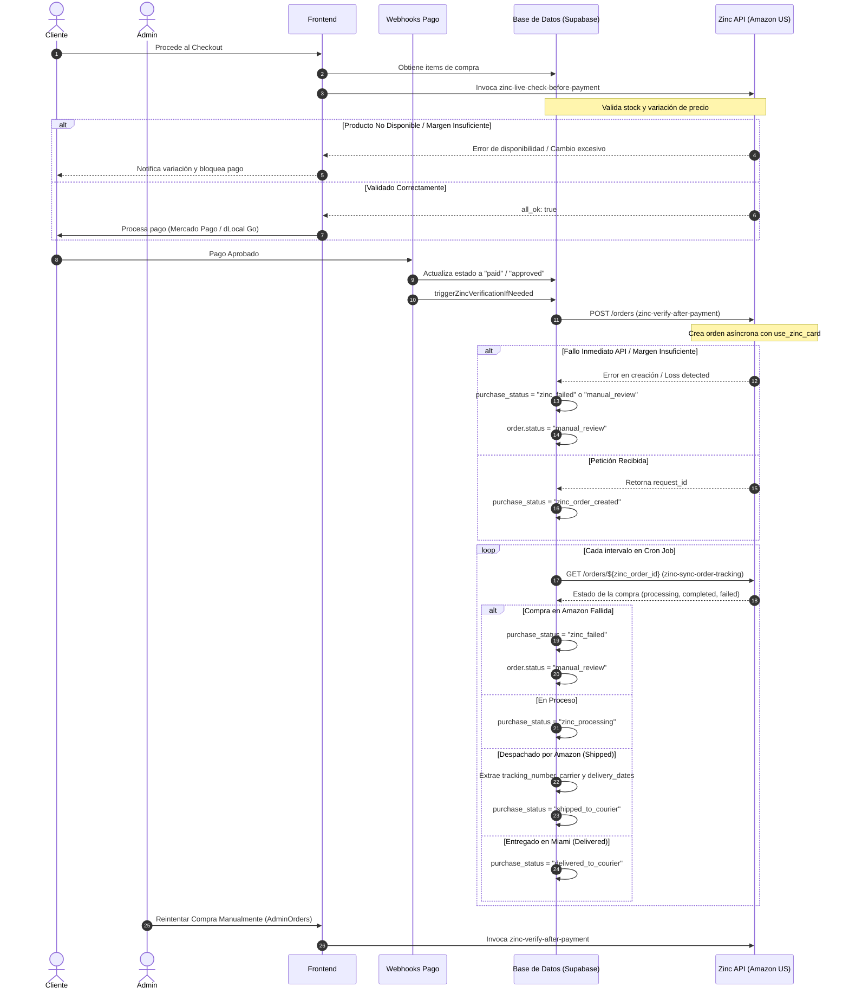
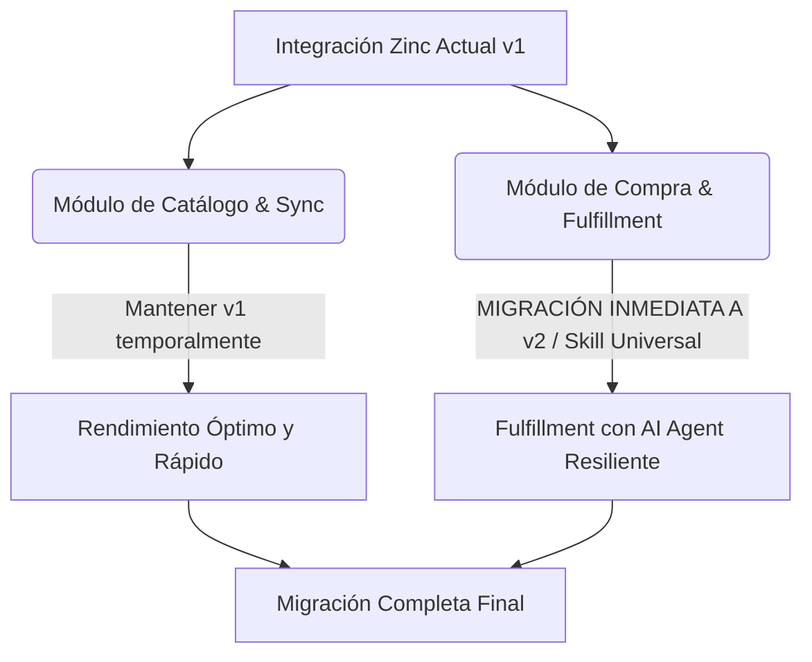

# Reporte de Auditoría: Integración con Zinc API
Este documento presenta una auditoría técnica completa de la integración actual de **Zinc API** en el proyecto **Collectibles2026**. Se detalla la arquitectura de red, la versión utilizada, los flujos funcionales, la compatibilidad, los riesgos de obsolescencia y las recomendaciones estratégicas para su evolución.

---

## 1. Endpoints Exactos Utilizados

La integración actual consume exclusivamente endpoints de la API tradicional de Zinc para la consulta de catálogo, verificación de inventarios y compra automatizada en Amazon US. A continuación, se detallan las URLs exactas y sus métodos HTTP:

| Operación / Propósito | Método | Endpoint Exacto |
| :--- | :---: | :--- |
| **Creación de Orden (Compra)** | `POST` | `https://api.zinc.com/orders` |
| **Monitoreo de Orden (Tracking/Status)** | `GET` | `https://api.zinc.com/orders/${zinc_order_id}` |
| **Búsqueda de Productos** | `GET` | `https://api.zinc.com/products/search?query=${query}&retailer=amazon&page=${page}` |
| **Consulta de Detalles / Live Check** | `GET` | `https://api.zinc.com/products/${external_product_id}?retailer=amazon` |
| **Sync de Producto (Fallback)** | `GET` | `https://api.zinc.com/products/search?query=${product_url_external}&retailer=amazon` |

---

## 2. Versión de API Utilizada (v1 o v2)

La integración actual utiliza la **API v1 (Legacy)** de Zinc, operada bajo el dominio principal `api.zinc.com` (el cual redirige internamente a las rutas tradicionales de la v1). 

### Evidencias de Uso de v1:
1. **Ausencia de prefijos de versión `/v2`:** Las llamadas se realizan directamente a `/orders` y `/products`. En el ecosistema de Zinc, Zinc v2 (Universal Checkout) utiliza una arquitectura conceptualmente distinta (Checkout Skills y workflows unificados bajo `/v2`).
2. **Payloads y Estructura de Parámetros:**
   - Envía el parámetro `retailer` con valor `'amazon'` de forma explícita.
   - Envía la directiva `use_zinc_card: true` dentro de `payment_method`, una configuración específica de cuentas gestionadas (Managed Accounts) en la v1 de Zinc.
   - Utiliza `max_price` expresado en centavos (`cents`) para la protección de pérdidas.
3. **Flujo de Polling Asincrónico:** El control de estados post-creación se basa en la recuperación de un `request_id` (o `id` del pedido) y posterior consulta recurrente al endpoint de órdenes tradicional para mapear los estados `'processing'`, `'completed'` y `'failed'`.

---

## 3. Archivos donde se consume Zinc

La integración está distribuida entre **Supabase Edge Functions** (capa servidora y tareas automáticas) y el **Frontend** de React (paneles de administración e interacción previa al pago).

### A. Supabase Edge Functions (Deno)

*   [zinc-verify-after-payment/index.ts](file:///c:/Projects/Collectibles2026/supabase/functions/zinc-verify-after-payment/index.ts):
    *   *Propósito:* Endpoint crítico de colocación de órdenes. Verifica dirección del courier, disponibilidad en vivo, protección de pérdidas basada en margen de ganancia real y realiza la petición `POST /orders` a Zinc.
*   [zinc-sync-order-tracking/index.ts](file:///c:/Projects/Collectibles2026/supabase/functions/zinc-sync-order-tracking/index.ts):
    *   *Propósito:* Tarea en segundo plano para sincronizar estados de pedidos y datos de tracking (`tracking_number`, `carrier`, `tracking_url` e `estimated_delivery_to_courier`).
*   [zinc-live-check-before-payment/index.ts](file:///c:/Projects/Collectibles2026/supabase/functions/zinc-live-check-before-payment/index.ts):
    *   *Propósito:* Ejecuta consultas en vivo a `/products` antes de procesar el pago del cliente para asegurar que el artículo sigue disponible y que los márgenes de ganancia no se han vulnerado por variaciones de precio en Amazon.
*   [zinc-sync-published-products/index.ts](file:///c:/Projects/Collectibles2026/supabase/functions/zinc-sync-published-products/index.ts):
    *   *Propósito:* Tarea cron de background (ejecutada cada 5 minutos mediante `pg_cron`) que valida lotes de 20 productos publicados para recalcular márgenes, precios en pesos uruguayos (UYU) y marcar artículos como no disponibles si salen de stock.
*   [zinc-search-products/index.ts](file:///c:/Projects/Collectibles2026/supabase/functions/zinc-search-products/index.ts):
    *   *Propósito:* Permite buscar productos directamente en el catálogo de Amazon usando la API de búsqueda de Zinc y guarda candidatos de importación en la BD.
*   [zinc-enrich-candidate/index.ts](file:///c:/Projects/Collectibles2026/supabase/functions/zinc-enrich-candidate/index.ts):
    *   *Propósito:* Obtiene detalles de candidatos seleccionados para poblar la base de datos de productos de importación internacional.
*   [zinc-import-candidates/index.ts](file:///c:/Projects/Collectibles2026/supabase/functions/zinc-import-candidates/index.ts):
    *   *Propósito:* Crea los registros definitivos de importación internacional calculando el precio final con fletes estimados (Urubox) y márgenes de ganancia.
*   [zinc-live-check/index.ts](file:///c:/Projects/Collectibles2026/supabase/functions/zinc-live-check/index.ts):
    *   *Propósito:* Endpoint auxiliar para validar la disponibilidad y márgenes de un producto individual de forma manual.
*   [_shared/order-payments.ts](file:///c:/Projects/Collectibles2026/supabase/functions/_shared/order-payments.ts):
    *   *Propósito:* Contiene el disparador asíncrono (`triggerZincVerificationIfNeeded`) que invoca a la función `zinc-verify-after-payment` tras la aprobación exitosa de pagos en Mercado Pago, dLocal Go o Mercado Libre.

### B. Frontend (React / TypeScript)

*   [Checkout.tsx](file:///c:/Projects/Collectibles2026/frontend/src/pages/Checkout.tsx):
    *   *Propósito:* Invoca `zinc-live-check-before-payment` al hacer click en el botón de pago final para evitar cobrar productos obsoletos o con pérdidas de margen.
*   [AdminOrders.tsx](file:///c:/Projects/Collectibles2026/frontend/src/pages/admin/AdminOrders.tsx):
    *   *Propósito:* Renderiza la pestaña "Importación Internacional (Zinc)" con la información del payload de Zinc y habilita al administrador para "Reintentar compra en Zinc" manualmente en caso de fallos.
*   [AdminInternationalAmazon.tsx](file:///c:/Projects/Collectibles2026/frontend/src/pages/admin/AdminInternationalAmazon.tsx):
    *   *Propósito:* Panel de curación de catálogo. Llama a los endpoints de búsqueda, importación y enriquecimiento.
*   [AdminInternationalProducts.tsx](file:///c:/Projects/Collectibles2026/frontend/src/pages/admin/AdminInternationalProducts.tsx):
    *   *Propósito:* Permite la sincronización manual de productos internacionales y muestra la data bruta de Zinc.
*   [AdminInternationalSync.tsx](file:///c:/Projects/Collectibles2026/frontend/src/pages/admin/AdminInternationalSync.tsx):
    *   *Propósito:* Configuración global del motor de sincronización (habilitar compra automática, Prime, recargos y tarifas base de Zinc).

---

## 4. Flujo de Trabajo Detallado

El ciclo de vida de los pedidos que contienen productos gestionados a través de Zinc sigue el siguiente flujo lógico:

### Gestión de Cancelación (¡Brecha de Integración Crítica!):
Actualmente, el flujo de **cancelación** no tiene ninguna automatización con la API de Zinc:
- Cuando una orden de venta se cancela en la plataforma local (mediante el Edge Function `refund-order`), la base de datos simplemente actualiza el estado a `cancelada` y procesa el reembolso del dinero del cliente.
- **No existe llamada al endpoint de cancelación de Zinc.**
- *Consecuencia:* Si el pedido ya fue enviado a Zinc (`zinc_order_created` o `zinc_processing`), el administrador debe entrar **manualmente** a la consola web de Zinc para cancelar el pedido antes de que Amazon lo envíe, de lo contrario, se comprará y despachará el producto generando una pérdida financiera directa para la tienda.

---

## 5. Variables de Entorno Utilizadas

La integración es simple a nivel de secretos y configuraciones del entorno. Se alimenta de:

| Variable | Ubicación / Uso | Propósito |
| :--- | :--- | :--- |
| **`ZINC_API_KEY`** | Supabase Edge Functions (Deno env) | Clave privada utilizada como Token de portador (`Authorization: Bearer ${ZINC_API_KEY}`) para autenticar todas las llamadas a la API de Zinc. |
| **`SUPABASE_URL`** | Supabase Edge Functions (Deno env) | URL base de la instancia de base de datos de Supabase para RLS y consultas internas. |
| **`SUPABASE_SERVICE_ROLE_KEY`** | Supabase Edge Functions (Deno env) | Token de acceso administrativo (bypass de RLS) para guardar payloads, trazas de error y actualizar campos de auditoría. |

> [!WARNING]
> Siguiendo la regla global de seguridad del proyecto, estas variables de entorno están estrictamente prohibidas de ser hardcodeadas o persistidas en el código de frontend o commits de git. Viven exclusivamente en las variables configuradas en el Dashboard de Supabase.

---

## 6. Compatibilidad Actual con Amazon US

La integración está fuertemente acoplada con **Amazon US**. Las restricciones de compatibilidad y dependencias actuales son las siguientes:

1. **Parámetro Retailer:** El valor `'amazon'` se envía estático en las solicitudes, limitando la integración a este mercado.
2. **Dirección de Envío predeterminada (Courier Miami/Doral):**
   - El sistema tiene por defecto los valores del courier de Miami/Doral (`2030 NW 95th AVE`, Doral, FL, 33172).
   - Extrae el número de suite dinámico (`international_suite`) de la dirección de envío del comprador en Uruguay para concatenarlo como `Suite ${suite}` en la línea 2 de la dirección estadounidense.
3. **Mapeo de Prime:** Depende de la flag `only_prime`. Si está activa, valida que el producto a sincronizar o comprar tenga envío Prime disponible (usando el campo `buy_box.prime` de la API de Zinc).
4. **Cálculo de Precios e Impuestos:**
   - La API de Zinc asume la compra bajo cuentas estadounidenses. Las tasas impositivas internas de EE. UU. (sales tax en Florida) no se estiman de manera dinámica por producto durante la cotización del checkout uruguayo, sino que se amortizan mediante un factor de ajuste constante en la base de datos y la estimación estática del costo financiero.

---

## 7. Funciones de Zinc No Utilizadas que Podrían Mejorar el Negocio

Actualmente la integración utiliza Zinc en un formato de mínimos viables (solo consulta básica de ASIN y colocación simple de orden). La API v1 y v2 exponen características no explotadas que solventarían deficiencias actuales:

### A. Estimación Dinámica de Costos (Order Preview)
*   *Deficiencia actual:* El sistema calcula de manera matemática y aproximada el costo real en el Edge Function `_shared/pricing.ts` (`calculateRealCost` y `applyProfitProtection`). Esto puede diferir del costo cobrado por impuestos interestatales de Amazon o fluctuaciones rápidas de envío nacional.
*   *Mejora:* Zinc posee un endpoint de **Order Preview** (en v1 `/orders` con flags específicas de preview). Este endpoint simula la compra en tiempo real y devuelve el desglose exacto de impuestos, tasas de envío y costo total del retailer sin realizar el cargo. Integrar esto en el checkout local garantizaría un margen de ganancia del 100% exacto.

### B. Estimación de Entrega Dinámica (Delivery Dates)
*   *Deficiencia actual:* Los tiempos de entrega que ve el usuario son genéricos o basados en cálculos offline estáticos.
*   *Mejora:* Al consultar detalles del producto o hacer el live check, Zinc expone la lista de opciones de envío rápido disponibles (`buy_box.shipping_message` o `offers[0].shipping_options`). Se podría extraer la fecha exacta estimada de arribo a Miami para mostrar un contador dinámico más preciso en el frontend (ej. *"Llega a nuestro depósito de Miami el [Fecha]"*).

### C. Validación de Stock Específica (Stock Level & Multiple Offers)
*   *Deficiencia actual:* El live check evalúa disponibilidad binaria (`available` o `unavailable`).
*   *Mejora:* Zinc ofrece datos del stock disponible real si el retailer lo expone y un listado de múltiples vendedores alternativos (`offers` array). Si el vendedor principal (Amazon Retail) se queda sin stock, el sistema podría conmutar automáticamente a la oferta de un tercero calificado (3P Seller) que cumpla con los estándares de calificación mínimos (ej. >95% positivo) y rango de precio permitido, incrementando la tasa de conversión.

### D. Cancelación Automatizada de Órdenes (Cancellation Endpoint)
*   *Deficiencia actual:* Vacío de control en cancelaciones locales.
*   *Mejora:* Consumir el endpoint `POST https://api.zinc.com/orders/${zinc_order_id}/cancel`. Al ejecutarse la devolución de una orden en Supabase, el backend debería disparar automáticamente la solicitud de cancelación a Zinc para frenar la compra en Amazon de manera inmediata.

---

## 8. Riesgos de Obsolescencia

El uso continuado de la API v1 de Zinc expone al ecommerce a riesgos operativos graves a mediano plazo:

1. **Fin de Soporte y Depreciación:** Zinc está enfocando todos sus esfuerzos en **Zinc 2.0 (v2)**. La v1 se mantiene por retrocompatibilidad, pero no recibe mejoras estructurales y se encuentra en estado de deprecación técnica progresiva.
2. **Fragilidad de los Scrapers (Scraping/Headless Browsing):** Zinc v1 funciona mediante emulación de navegadores y scraping estructurado. Cada vez que Amazon cambia su diseño de checkout o actualiza sus algoritmos de detección de bots, las llamadas de creación de órdenes fallan catastróficamente (`action_required`, `captcha`, `verification_required`).
3. **Manejo de Cuentas de Compras:** La v1 requiere una monitorización manual exhaustiva de las credenciales de pago y el estado de la cuenta de compras (Managed Accounts). Los fallos de sesión de Amazon congelan la pasarela de automatización hasta que se interactúa manualmente en su consola.

---

## 9. Recomendación Estratégica de Migración

Teniendo en cuenta que el core de la tienda internacional corre de manera estable para las consultas del catálogo pero sufre en la automatización del flujo de compras, se recomienda una **Migración Parcial y Progresiva**:

### Justificación de Recomendaciones:

#### Opción A: Mantener v1 (No Recomendado)
*   *Riesgo:* Alta tasa de errores manuales en checkout y abandono por fallos inesperados de scrapers en fechas de alto tráfico (Black Friday, Navidad).

#### Opción B: Migrar Parcialmente (Recomendación Principal ⭐)
1. **Mantener en v1 (Fase de Catálogo):** La sincronización de catálogo, búsqueda de productos y chequeo de precios rápido funciona correctamente con la v1 ya implementada en Supabase Edge Functions. No genera fricción y no amerita la reescritura total del flujo de sincronización cron (que procesa miles de productos).
2. **Migrar a v2 (Fase de Compra - Universal Checkout):** Migrar exclusivamente el endpoint de colocación de órdenes (`zinc-verify-after-payment`) hacia la API v2 de Zinc. 
   - *Por qué:* Zinc v2 introduce capacidades de automatización basadas en IA que son inmunes a los cambios menores de diseño de Amazon. Ofrece soporte nativo "Human in the loop" para resolver los bloqueos de seguridad del checkout de Amazon sin detener el flujo de compras de la tienda.

#### Opción C: Migrar Completamente a v2 (Recomendado a Largo Plazo)
*   Realizar una migración completa de todo el ecosistema (búsqueda, sincronización y órdenes) una vez que las API de sincronización masiva y reportes de seguimiento de tracking de la v2 salgan de su fase beta y estén a la par en rendimiento de cuotas con la v1.

---

## 10. Plan de Acción de Próximos Pasos (Quick Wins)

Si se decide mantener la arquitectura actual antes de iniciar una migración a v2, se deben implementar las siguientes correcciones urgentes en la v1 para mitigar pérdidas financieras:

1. **Implementar Cancelación en Zinc:**
   Modificar el Edge Function `refund-order` para verificar si el producto devuelto es internacional. De ser así, recuperar el `zinc_order_id` de `international_order_items` y enviar una solicitud HTTP POST a `https://api.zinc.com/orders/${zinc_order_id}/cancel`.
2. **Mitigar Sales Tax en Miami:**
   Implementar una llamada de Order Preview en `zinc-live-check-before-payment` para detectar cargos de taxes de Amazon locales en Florida y sumarlos dinámicamente al precio final del cliente, en lugar de absorberlos en el margen de ganancia.
