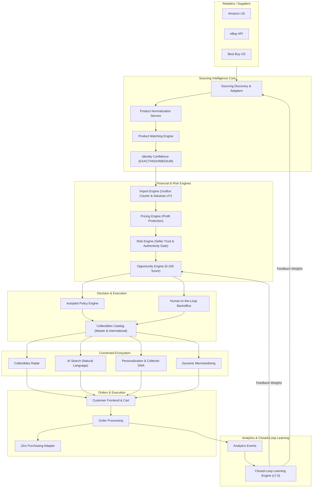
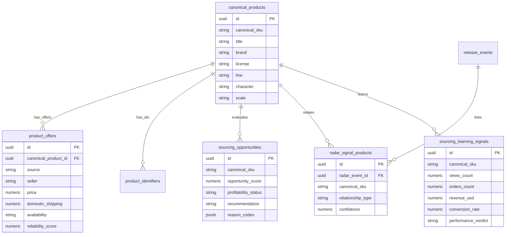

# Sourcing Intelligence — System Architecture (Phase 7 Integration)

## 1. Overview
Sourcing Intelligence operates as the commercial selection engine of Collectibles 2026. It connects upstream suppliers (Amazon, eBay, Best Buy) with internal product master catalog entities, land cost import calculations, Uruguay market gap analysis, risk scoring, autopilot execution, Radar trend signals, AI search, personalization, dynamic merchandising, order execution via Zinc, and closed-loop learning feedback.

---

## 2. Master Domain Architecture Diagram

---

## 3. Core Database Schemas

---

## 4. Key Pipelines & Contracts

### A. Sourcing Pipeline
`RETAILER OFFER -> NORMALIZATION -> MATCHING -> LANDED COST UY -> RISK -> OPPORTUNITY SCORE -> AUTOPILOT -> CATALOG`

### B. Connected Discovery Pipeline
`RADAR TREND -> SOURCING GAP ANALYSIS -> OPPORTUNITY CREATION -> AUTOPILOT PUBLISH -> RADAR LINK ("Ver productos")`

### C. Search & Personalization Pipeline
`USER QUERY -> AI SEARCH PARSER -> DB FILTER -> COLLECTOR DNA SIGNAL -> DYNAMIC MERCHANDISING RANKING`

### D. Order & Purchasing Pipeline
`FRONTEND CART -> PRE-PURCHASE VALIDATION -> ZINC ADAPTER -> FULFILLMENT -> LEARNING ENGINE FEEDBACK`
